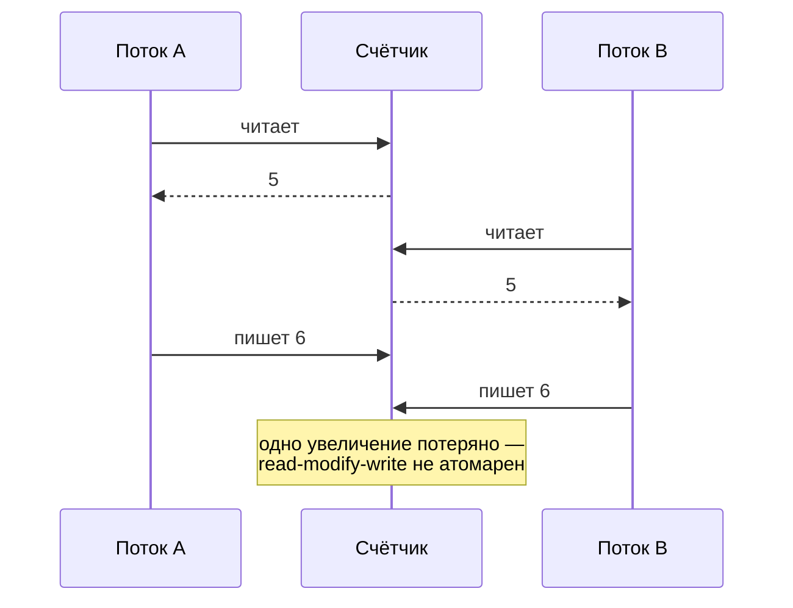

# Конкурентность и параллелизм

[← Сложность алгоритмов](complexity.md) · [🏠 Домой](../README.md) · [Тестирование →](testing.md)

---

## Чем конкурентность отличается от параллелизма?

**Коротко.** Конкурентность — свойство *структуры программы*: несколько задач
выполняются в перекрывающиеся промежутки времени и могут чередоваться.
Параллелизм — свойство *исполнения*: несколько задач физически выполняются
одновременно на разных ядрах. Конкурентная программа может работать на одном
ядре; параллельное исполнение без конкурентной структуры невозможно.

Отсюда выбор модели по типу нагрузки: если задача **I/O-bound** (ждём сеть,
диск, БД), выигрыш даёт конкурентность — пока одна задача ждёт, работают
другие, и хватит одного потока. Если задача **CPU-bound** (считаем), помогает
только настоящий параллелизм на нескольких ядрах или процессах.

| | Процессы | Потоки | Асинхронность |
|---|---|---|---|
| Память | раздельная | общая | общая |
| Переключение | дорогое, ядром ОС | дешевле, ядром ОС | самое дешёвое, в рантайме |
| Точки переключения | в любой момент | в любой момент | только на `await` |
| Гонки | нет (нужен IPC) | есть | есть, но предсказуемее |
| Годится для | CPU-bound | блокирующий I/O | массовый I/O |

**Подвох.** Асинхронность не делает код быстрее сама по себе — она позволяет
не простаивать в ожидании. Одна блокирующая операция (тяжёлый расчёт или
синхронный вызов) внутри цикла событий останавливает **все** задачи сразу,
и выгода исчезает.

**Глубже.** Вытесняющая многозадачность (потоки, процессы) — планировщик
отбирает управление в произвольный момент, поэтому гонка возможна между любыми
двумя инструкциями. Кооперативная (async/await, корутины) — управление
передаётся только в явных точках, поэтому код между двумя `await` атомарен
относительно других корутин. Это радикально сужает пространство гонок,
но взамен требует, чтобы ни одна задача не «зажимала» цикл событий.

**В Python:** GIL, `threading` / `multiprocessing` / `asyncio` и когда что —
[GIL и конкурентность](../python/concurrency-gil.md); структурная
конкурентность и отмена — [`asyncio.TaskGroup`](../python/asyncio-taskgroup.md);
исполнение без GIL — [free-threading и JIT](../python/free-threading-jit.md).

---

## Что такое гонка данных, deadlock и как их избегают?

**Коротко.** Гонка (race condition) — результат зависит от порядка выполнения
операций в разных потоках; классический случай — неатомарное «прочитать,
изменить, записать». Deadlock — два потока держат по ресурсу и ждут ресурс
друг друга, оба стоят вечно.

Дедлок как цикл в графе ожидания:

Средства синхронизации: мьютекс (взаимное исключение), семафор (ограничение
числа одновременных), условная переменная (ждать события), атомарные операции,
очередь — передача владения данными вместо их разделения.

Условия возникновения deadlock (все четыре одновременно): взаимное исключение,
удержание с ожиданием, отсутствие вытеснения, циклическое ожидание. Ломать
достаточно одно — отсюда практические приёмы: **единый порядок захвата
блокировок**, таймауты на захват, захват всех нужных ресурсов разом.

**Подвох.** Не путать deadlock с livelock и starvation. При livelock потоки
активно работают (уступают друг другу и повторяют попытку), но прогресса нет.
При starvation система работает, но конкретный поток не получает ресурс —
например, при несправедливом планировании или постоянном потоке приоритетных
задач.

**Глубже.** Лучшая защита от гонок — их отсутствие по конструкции: неизменяемые
данные, отсутствие разделяемого состояния и передача сообщений вместо общей
памяти (модель акторов, CSP-каналы). Там, где состояние всё же разделяется,
работают правила: одна блокировка на один инвариант, минимальная критическая
секция, никаких блокирующих или пользовательских вызовов под блокировкой.

Видимость памяти (memory visibility) — отдельное от гонки данных явление: гонка
про порядок операций (кто успел первым), видимость про то, увидит ли поток
чужую запись вообще, даже без состязания за порядок. Значение может застрять
в регистре или кеше процессора одного ядра, а компилятор и CPU вправе
переупорядочить операции, если это не меняет поведение одного потока —
другой поток тогда читает устаревшее значение сколь угодно долго. Гарантирует
видимость модель happens-before: если операция A happens-before операции B,
эффекты A видны в B; синхронизация (захват мьютекса, барьер памяти, атомарная
операция) — это и есть механизм, который такое отношение устанавливает.

**В SQL:** та же задача на уровне БД — уровни изоляции, MVCC, аномалии
(грязное и неповторяемое чтение, фантомы) и взаимоблокировки транзакций —
[ACID и изоляция](../sql/acid-and-null.md).

---

[← Сложность алгоритмов](complexity.md) · [🏠 Домой](../README.md) · [Тестирование →](testing.md)
