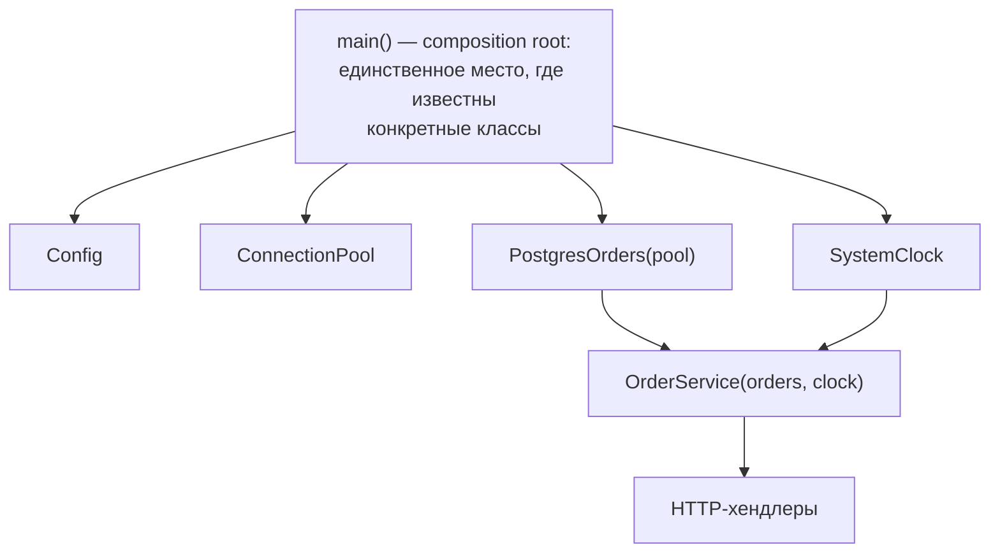
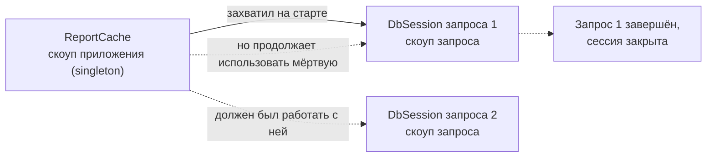

# Внедрение зависимостей (DI) и инверсия управления (IoC)

[← SOLID](solid.md) · [🏠 Домой](../README.md) · [Принципы проектирования →](principles.md)

---

## Что такое dependency injection и чем оно отличается от DIP и IoC?

**Коротко.** Три разных уровня одного разговора. **IoC** (inversion of control) —
общий принцип: управление потоком передано наружу, не ваш код вызывает
фреймворк, а фреймворк вызывает ваш. **DIP** — принцип из
[SOLID](solid.md): зависеть от абстракций, причём абстракцию определяет
верхний уровень. **DI** — конкретная техника: объект не создаёт свои
зависимости сам, а получает их извне.

Отсюда видно, что путать их нельзя: можно применять DI и нарушать DIP (если
внедряется конкретный класс, а не абстракция), и наоборот — соблюдать DIP,
собирая объекты вручную без всякого контейнера.

```python
# без DI: зависимость создаётся внутри — подменить нечем
class ReportService:
    def __init__(self) -> None:
        self.db = PostgresClient("host=prod")   # жёстко и намертво

# с DI: зависимость приходит снаружи, тип — абстракция (соблюдён и DIP)
class ReportService:
    def __init__(self, orders: Orders) -> None:
        self.orders = orders
```

Что это даёт на практике: в тесте вместо базы подставляется in-memory
реализация; в другом окружении — другой адаптер; зависимости объекта видны
в сигнатуре, а не спрятаны в глубине методов.

**Подвох.** «DI — это фреймворк/контейнер». Нет: `service = ReportService(repo)`
— уже полноценное внедрение зависимости. Контейнер лишь автоматизирует сборку,
когда графов объектов становится много; на небольшом приложении он не нужен
([YAGNI](principles.md)).

**Глубже.** Скрытая зависимость — та, которую не видно снаружи: обращение к
глобальной переменной, синглтону, `datetime.now()`, генератору случайных
чисел, переменной окружения. Именно они делают тесты нестабильными и
зависимыми от порядка запуска. Приём — внедрять и их тоже: часы (`clock`),
источник случайности, источник конфигурации становятся обычными параметрами.

**В Python:** протоколы как тип внедряемой зависимости —
[базовый `typing`](../python/typing-basics.md); почему модуль сам по себе
глобальное состояние и как это ломает изоляцию —
[область видимости и замыкания](../python/scoping-closures.md).

---

## Какие есть способы внедрения и какой выбрать?

**Коротко.** Через конструктор, через сеттер (свойство) и через параметр
метода. По умолчанию — конструктор: объект после создания сразу валиден и
неизменяем, а список зависимостей виден в одном месте.

- **Конструктор.** Обязательные зависимости. Объект нельзя создать в
  нерабочем состоянии — инвариант обеспечен конструкцией.
- **Сеттер / свойство.** Опциональные зависимости с разумным умолчанием
  (например, метрики или кеш). Цена — объект какое-то время существует
  недонастроенным, появляются проверки на `None`.
- **Параметр метода.** Зависимость нужна только одной операции и меняется
  от вызова к вызову; хранить её в объекте незачем.

```python
class OrderService:
    def __init__(self, orders: Orders, clock: Clock) -> None:  # обязательные
        self._orders = orders
        self._clock = clock
        self._metrics: Metrics | None = None                   # опциональная

    def export(self, sink: Writer) -> None:                    # для одного вызова
        ...
```

**Подвох.** Конструктор на восемь зависимостей — не проблема DI, а сигнал
нарушения [SRP](solid.md): класс делает слишком много. Лечится разделением
класса или группировкой связанных зависимостей в один объект-фасад, а не
переходом на сеттеры «чтобы список был короче».

**Глубже.** Циклическая зависимость (`A` требует `B`, `B` требует `A`) при
внедрении через конструктор просто не собирается — и это хорошо: цикл виден
сразу, на старте приложения. Сеттеры и ленивые прокси позволяют цикл
«обойти», но проблема архитектуры остаётся; правильное решение — выделить
третий объект или интерфейс, от которого зависят оба.

---

## Что такое DI-контейнер и composition root?

**Коротко.** Composition root — единственное место, где приложение собирает
граф объектов: точка входа, `main`, фабрика приложения. DI-контейнер —
библиотека, которая делает эту сборку по регистрации типов, разрешая
зависимости автоматически и управляя их временем жизни.



Типовые времена жизни (скоупы), которые контейнер умеет:

| Скоуп | Один экземпляр на | Пример |
|---|---|---|
| singleton | всё приложение | пул соединений, конфиг |
| scoped / request | один запрос или задачу | транзакция, сессия БД |
| transient | каждое разрешение | объект с состоянием одной операции |

**Подвох.** Классическая ошибка — *captive dependency*: объект со скоупом
singleton держит внутри себя scoped-зависимость. Сессия БД, захваченная
синглтоном на старте, переживёт свой запрос и будет использована повторно —
отсюда «внезапно закрытые» соединения и утечки данных между запросами.
Хороший контейнер такие сочетания проверяет, но полагаться на это нельзя.



**Глубже.** Service locator — вырожденный анти-вариант DI: объект сам
запрашивает зависимости из глобального реестра (`Locator.get(Orders)`).
Внешне похоже, но зависимости снова скрыты — по сигнатуре класса не видно,
что ему нужно, ошибка конфигурации всплывает в рантайме, а тест обязан
настраивать глобальный реестр. Отличать эти два подхода на собеседовании
просят часто: DI — зависимость **отдают** объекту, service locator —
объект **забирает** её сам.

---

## Зачем DI, если можно просто передавать функции?

**Коротко.** В языках с функциями первого класса «зависимость» часто и есть
функция, а внедрение — обычный параметр или частичное применение. Классы и
контейнеры нужны там, где зависимость — это несколько связанных операций
с общим состоянием и конфигурацией.

```python
from functools import partial

def send_report(rows, *, now, send):     # зависимости — обычные параметры
    send(subject=f"Отчёт на {now():%Y-%m-%d}", body=render(rows))

# сборка на входе в приложение — тот же composition root
report = partial(send_report, now=datetime.now, send=smtp_send)
```

**Подвох.** Значения по умолчанию, вычисляемые в момент объявления функции,
превращают «внедрение» обратно в жёсткую привязку: аргумент по умолчанию
вычисляется один раз при создании функции, а не при каждом вызове. Такой
приём годится для констант и не годится для объектов с состоянием.

**Глубже.** Функциональный аналог контейнера — композиция частично
применённых функций и замыканий в одной точке сборки. Плюс — нет магии
и рефлексии, граф виден глазами; минус — при десятках компонентов сборка
становится многословной, и это ровно та точка, где контейнер начинает
окупаться.

**В Python:** оборачивание и параметризация поведения —
[декораторы](../python/decorators.md) и
[функциональный стиль](../python/functional-programming.md); управление
временем жизни ресурса при внедрении — [контекстные
менеджеры](../python/context-managers.md); почему изменяемый аргумент по
умолчанию живёт между вызовами —
[типы данных](../python/data-types.md).

---

[← SOLID](solid.md) · [🏠 Домой](../README.md) · [Принципы проектирования →](principles.md)
