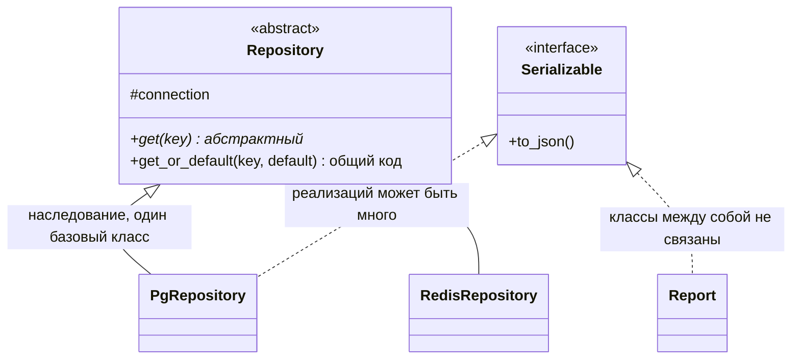

# Четыре столпа ООП: абстракция, инкапсуляция, наследование, полиморфизм

[← Парадигмы программирования](paradigms.md) · [🏠 Домой](../README.md) · [Связи между классами →](oop-relations.md)

---

## Назовите принципы ООП и объясните каждый

**Коротко.** Абстракция — выделить существенное и скрыть остальное.
Инкапсуляция — держать данные и операции над ними вместе, а доступ снаружи
пускать только через интерфейс. Наследование — переиспользовать и уточнять
поведение базового типа. Полиморфизм — работать с разными типами через один
интерфейс, не зная конкретного класса.

**Абстракция** отвечает на вопрос «что этот объект умеет», а не «как он
устроен». Класс `PaymentGateway` с методом `charge(amount)` — абстракция:
вызывающему всё равно, HTTP там или очередь.

**Инкапсуляция** — не про «поставить `private`», а про инвариант: объект сам
отвечает за то, чтобы его состояние всегда было валидным. Если баланс счёта
нельзя увести в минус, то поле баланса не должно быть доступно на запись
снаружи — иначе инвариант обеспечить невозможно.

```python
class Account:
    def __init__(self, balance: int = 0) -> None:
        self._balance = balance

    @property
    def balance(self) -> int:          # читать можно
        return self._balance

    def withdraw(self, amount: int) -> None:
        if amount > self._balance:     # инвариант проверяется в одном месте
            raise ValueError("недостаточно средств")
        self._balance -= amount
```

**Наследование** выражает отношение «является» (is-a): `SavingsAccount`
является `Account`. **Полиморфизм** — способность вызвать `account.withdraw()`
на любом наследнике и получить корректное поведение конкретного класса.

**Подвох.** Классический вопрос: «инкапсуляция — это же геттеры и сеттеры?»
Нет. Класс, где каждое поле обвешано `get_x`/`set_x`, инкапсуляции не даёт:
состояние всё так же открыто на запись, просто через два лишних метода. Это
антипаттерн anemic domain model — данные в одном месте, логика в другом.

**Глубже.** Виды полиморфизма различают явно:
- *ad hoc* — перегрузка операторов/функций по типам аргументов: `1 + 2` и
  `"a" + "b"` вызывают разный код через один и тот же оператор `+`
  (Java, C++; в Python — через `__add__`);
- *параметрический* — дженерики/шаблоны, один и тот же код `Stack[T]`
  работает для любого типа `T`, не зная его заранее;
- *подтипов (subtyping)* — переопределение метода в подклассе:
  `shape.area()` вызывает реализацию `Circle` или `Square` через ссылку
  на базовый тип `Shape`;
- *приведения (coercion)* — неявное приведение типов при операции:
  `1 + 2.0` молча приводит `int` к `float` перед сложением;
- *утиная типизация (duck typing)* — тип определяется набором методов,
  а не объявленным родителем; проверяется в рантайме.

**В Python:** реализация — [ООП вглубь](../python/oop-advanced.md) (MRO, `super()`,
дескрипторы, `__slots__`, метаклассы); `property` и приватность через `_`/`__`
там же; параметрический полиморфизм — [дженерики и `Self`](../python/typing-advanced.md);
структурная типизация вместо наследования — `Protocol` в
[базовом `typing`](../python/typing-basics.md).

---

## Чем абстрактный класс отличается от интерфейса?

**Коротко.** Интерфейс — только контракт: набор сигнатур без состояния и (как
правило) без реализации. Абстрактный класс — частично реализованный базовый
тип: может хранить поля и общий код, но не может быть инстанцирован.
Интерфейсов класс реализует сколько угодно, базовый класс обычно один.

Выбор простой: нужен **общий код и состояние** для семейства классов — базовый
абстрактный класс; нужно, чтобы **не связанные между собой** классы умели
что-то одинаковое — интерфейс.



```python
from abc import ABC, abstractmethod

class Repository(ABC):
    @abstractmethod
    def get(self, key: str) -> bytes: ...

    def get_or_default(self, key: str, default: bytes) -> bytes:
        try:                       # общий код живёт в абстрактном классе
            return self.get(key)
        except KeyError:
            return default

Repository()
# TypeError: Can't instantiate abstract class Repository
# with abstract method get
```

**Подвох.** «Раз в языке нет `interface`, значит нет и интерфейсов» — неверно.
Интерфейс это идея, а не ключевое слово: в Python его роль играют `ABC` без
реализации и `Protocol`, в Go — неявные интерфейсы, в C++ — классы с чисто
виртуальными методами.

**Глубже.** Разница между *номинальной* и *структурной* типизацией. При
номинальной класс совместим с интерфейсом, только если объявил это явно
(`class A implements B`). При структурной достаточно совпадения формы —
методы есть, значит подходит; так работают `Protocol` в Python, интерфейсы
в Go и TypeScript. Структурная типизация снимает проблему адаптации чужих
классов: их не нужно править, чтобы они «реализовали» ваш контракт.

**В Python:** `ABC`, `abstractmethod` и `Protocol` — в
[ООП вглубь](../python/oop-advanced.md) и [базовом `typing`](../python/typing-basics.md).

---

## Что такое утиная типизация?

**Коротко.** «Если крякает как утка — значит утка»: пригодность объекта
определяется наличием нужных методов, а не его классом. Проверка происходит
в момент вызова, а не при компиляции.

```python
class FileLike:
    def write(self, data: str) -> None:
        print("получено:", data)

def dump(sink, rows):          # sink — что угодно с .write()
    for r in rows:
        sink.write(str(r))

dump(FileLike(), [1, 2])
# получено: 1
# получено: 2
```

**Подвох.** Утиная типизация не отменяет контракт, а делает его неявным.
Ошибка вылезет не там, где объект передали, а глубоко внутри, в момент вызова
отсутствующего метода. Лекарство — описать ожидаемую форму явно (`Protocol`,
интерфейс) и проверять статически.

**Глубже.** Принцип EAFP (easier to ask forgiveness than permission) — прямое
следствие: вместо `if hasattr(obj, "write")` просто вызывают метод и ловят
`AttributeError`. Это дешевле по времени в успешном случае и не создаёт гонки
между проверкой и использованием (TOCTOU).

**В Python:** EAFP vs LBYL и иерархия исключений — [Исключения](../python/exceptions.md).

---

[← Парадигмы программирования](paradigms.md) · [🏠 Домой](../README.md) · [Связи между классами →](oop-relations.md)
