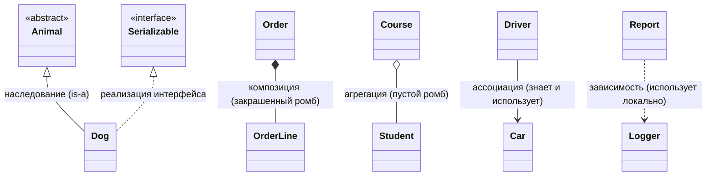
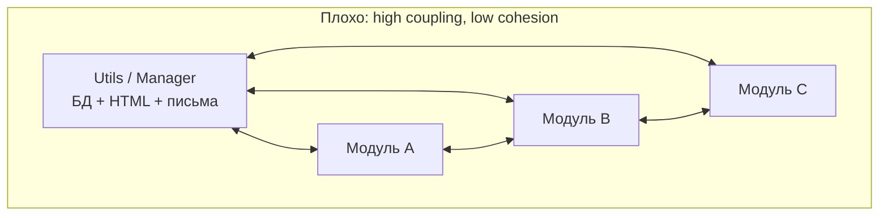
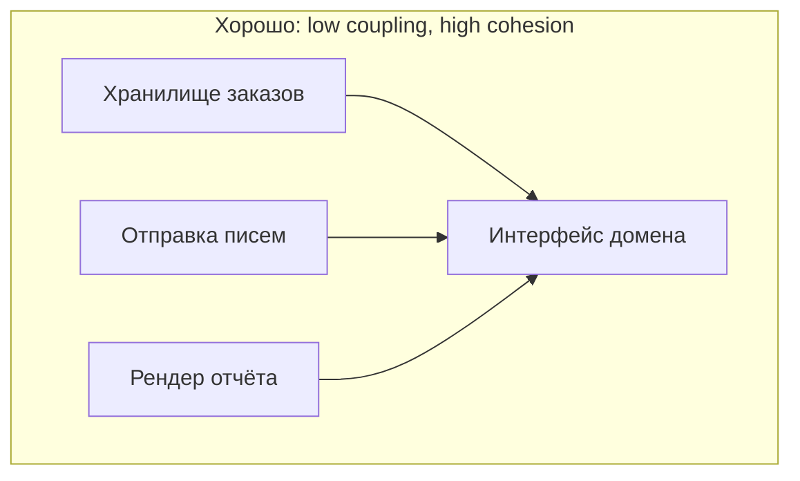

# Связи между классами: наследование, композиция, агрегация

[← Четыре столпа ООП](oop-basics.md) · [🏠 Домой](../README.md) · [SOLID →](solid.md)

---

## Чем композиция отличается от наследования и что выбрать?

**Коротко.** Наследование — отношение «является» (is-a) и связь на этапе
компиляции: наследник получает всё, включая то, что ему не нужно. Композиция —
отношение «имеет» (has-a): объект хранит другой объект и делегирует ему работу,
связь заменяема в рантайме. Правило по умолчанию — **предпочитать композицию
наследованию**.

Наследование даёт самую сильную связанность из возможных: наследник зависит не
только от публичного API родителя, но и от его внутреннего поведения. Меняется
родитель — молча ломаются наследники. Это называют fragile base class problem.

Все виды связей в нотации UML, которую рисуют на доске:



```python
# наследование: логгер намертво вшит в тип
class JsonExporter(FileWriter):
    def export(self, rows): self.write(dumps(rows))

# композиция: writer подменяется — в тестах, в другом окружении
class JsonExporter:
    def __init__(self, writer):
        self._writer = writer          # has-a
    def export(self, rows):
        self._writer.write(dumps(rows))
```

**Подвох.** Классический пример неправильного is-a — квадрат и прямоугольник.
Математически квадрат — частный случай прямоугольника, но `Square(Rectangle)`
ломает код, который ожидает независимо менять ширину и высоту. Это нарушение
[принципа подстановки Лисков](solid.md). Вывод: наследование выражает не
сходство в предметной области, а **взаимозаменяемость в коде**.

**Глубже.** Наследование оправдано, когда одновременно верно: (1) отношение
действительно is-a, (2) базовый класс спроектирован под наследование —
задокументировано, какие методы переопределять, (3) наследник не сужает
контракт. Если хоть одно не выполняется — композиция плюс интерфейс. Отдельный
приём — делегирование: объект хранит реализацию и пробрасывает вызовы, а
интерфейс сохраняет.

**В Python:** MRO и кооперативное наследование через `super()`, миксины,
подмена поведения через дескрипторы — [ООП вглубь](../python/oop-advanced.md).

---

## Чем агрегация отличается от композиции?

**Коротко.** Это две разновидности has-a, различающиеся временем жизни. При
композиции часть не существует без целого (заказ и его позиции — удалили
заказ, позиции бессмысленны). При агрегации часть живёт самостоятельно и
может быть общей (курс и студенты — курс закрыли, студенты остались).

|             | Композиция            | Агрегация              |
| ----------- | --------------------- | ---------------------- |
| Время жизни | часть умирает с целым | часть переживает целое |
| Владение    | исключительное        | разделяемое            |
| UML         | закрашенный ромб      | пустой ромб            |
| Пример      | `Order` → `OrderLine` | `Course` → `Student`   |

```python
class Order:
    def __init__(self, lines: list["OrderLine"]) -> None:
        self._lines = lines           # композиция: создаются вместе с заказом

class Course:
    def __init__(self) -> None:
        self._students: list["Student"] = []
    def enroll(self, student: "Student") -> None:
        self._students.append(student)   # агрегация: студент существует сам по себе
```

**Подвох.** В коде без сборщика мусора разница критична (кто вызывает
деструктор), а в языках с GC она вырождается в **семантику предметной
области**: кто имеет право удалять и изменять объект. Отвечать стоит именно
про владение, а не про синтаксис — синтаксис одинаковый.

**Глубже.** Это же различие определяет границы агрегата в DDD: агрегат —
кластер объектов с единой точкой входа (корнем), внутри которой поддерживается
инвариант, и снаружи на внутренние части ссылаться нельзя. Прямое отражение в
БД — `ON DELETE CASCADE` для композиции против `ON DELETE RESTRICT`/`SET NULL`
для агрегации.

**В SQL:** связи 1:1, 1:N, M:N — [СУБД и сущности](../sql/dbms-basics.md);
поведение при удалении — [ключи и ограничения](../sql/keys-constraints.md).

---

## Что такое связанность (coupling) и связность (cohesion)?

**Коротко.** Связанность — насколько сильно модули зависят друг от друга;
её минимизируют. Связность — насколько элементы внутри модуля решают одну
задачу; её максимизируют. Цель: low coupling, high cohesion.





Признаки высокой связанности: изменение в одном модуле требует правок в
нескольких других; модуль лезет во внутренности чужого объекта; циклические
зависимости между пакетами. Признаки низкой связности: класс `Utils` или
`Manager`, где лежит всё подряд; сервис, который одновременно ходит в БД,
рендерит HTML и шлёт письма.

**Подвох.** Ноль связанности недостижим — модули обязаны взаимодействовать,
иначе системы нет. Управляют не количеством связей, а их **направлением и
формой**: зависеть от абстракции, а не от реализации; зависимости направлять
внутрь, к домену; передавать данные, а не объекты со скрытым состоянием.

**Глубже.** Виды связанности по возрастанию вредности: по данным (передали
скаляр) → по структуре (передали DTO) → по управлению (передали флаг,
меняющий ветку внутри) → общая (общая глобальная переменная) → по содержимому
(лезем в приватные поля). Флаг-аргумент, переключающий поведение функции, —
уже control coupling, и это повод разделить функцию на две.

**Смежное:** практические приёмы снижения связанности — [принципы
проектирования](principles.md) и [SOLID](solid.md), архитектурные —
[архитектурные стили](architecture.md).

---

[← Четыре столпа ООП](oop-basics.md) · [🏠 Домой](../README.md) · [SOLID →](solid.md)
