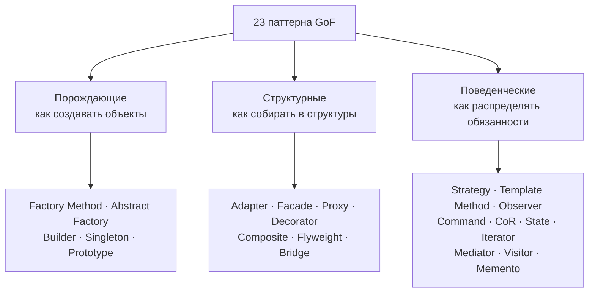
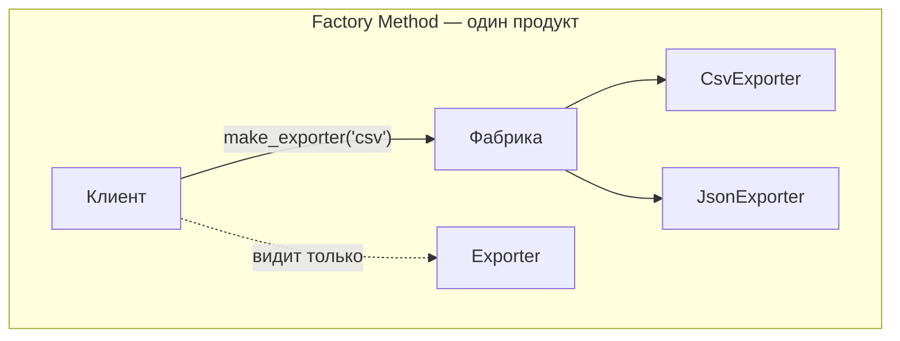
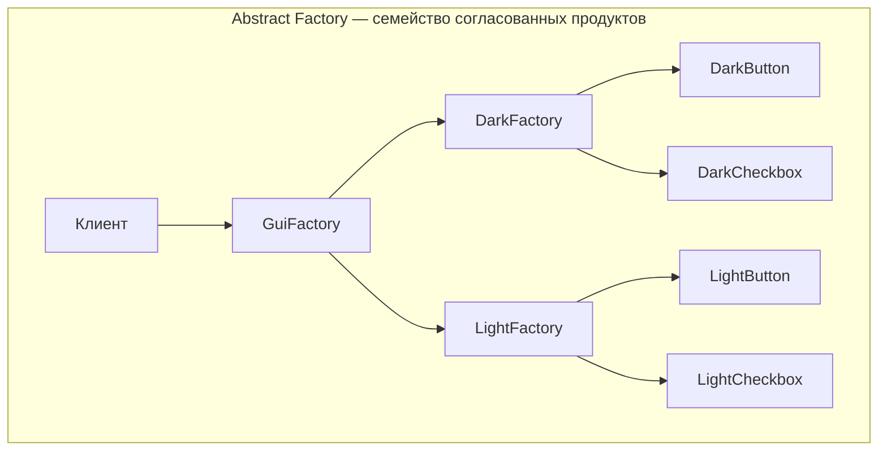
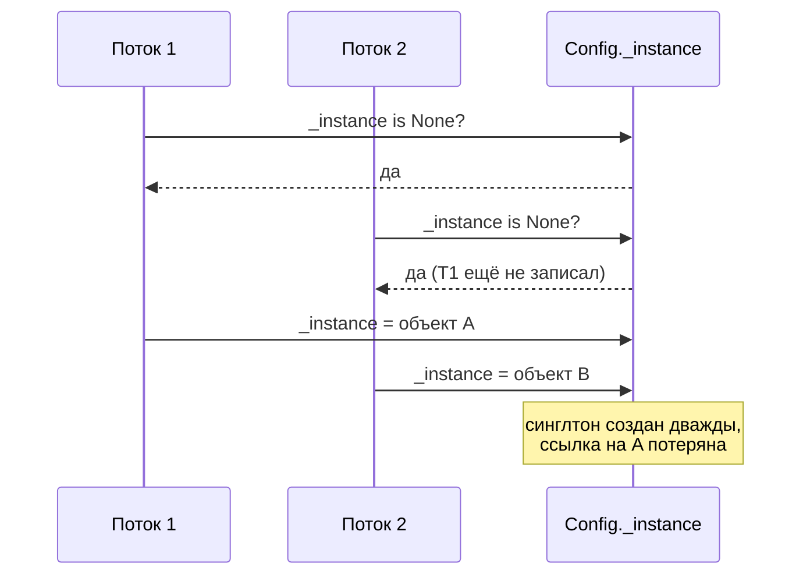
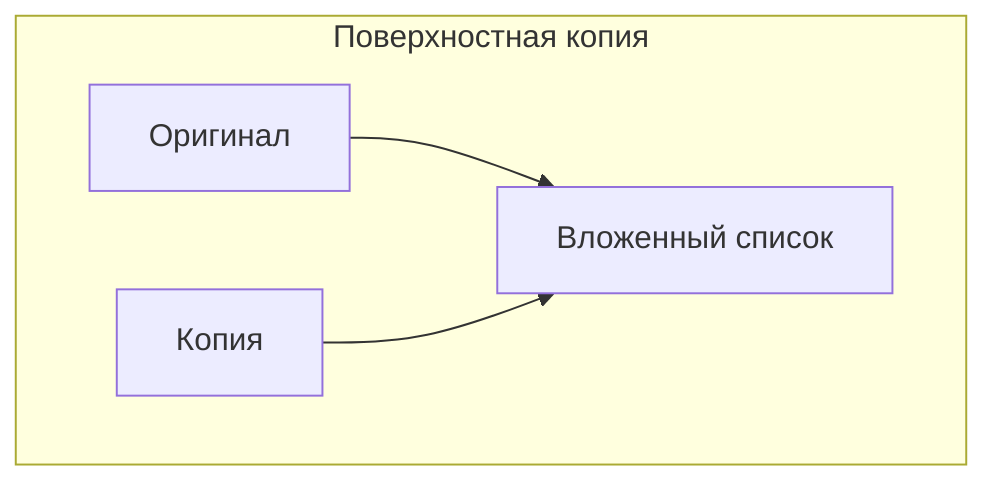
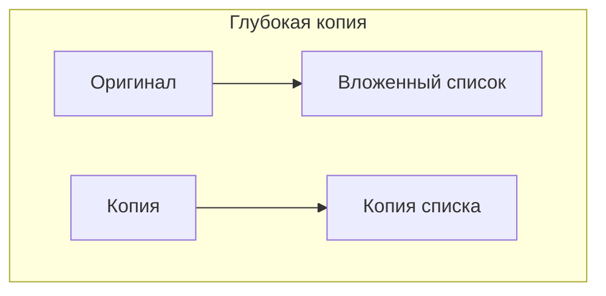

# Порождающие паттерны

[← Принципы проектирования](principles.md) · [🏠 Домой](../README.md) · [Структурные паттерны →](patterns-structural.md)

---

## Что такое паттерн проектирования и какие есть группы?

**Коротко.** Паттерн — типовое решение повторяющейся задачи проектирования,
описанное как «проблема → решение → последствия». Каталог GoF делит 23 паттерна
на три группы: порождающие (как создавать объекты), структурные (как собирать
объекты в структуры), поведенческие (как распределять обязанности и
взаимодействие).



**Подвох.** Частый провал на собеседовании — пересказ реализации вместо
проблемы. Паттерн ценен формулировкой «когда применять и чем платить».
Хороший ответ всегда содержит цену: singleton — глобальное состояние и боль
в тестах, observer — неявный поток управления, abstract factory — рост числа
классов.

**Глубже.** Часть паттернов GoF — обходные пути для языков без функций
первого класса, дженериков и модулей. Strategy, Command и Template Method в
Python часто сворачиваются в функцию, переданную аргументом; Singleton — в
модуль; Iterator встроен в язык. Это тоже правильный ответ: «в этом языке
паттерн вырождается в такую-то конструкцию».

---

## Factory Method и Abstract Factory

**Коротко.** Factory Method — метод, создающий объект, конкретный класс
которого выбирается наследником или условием: клиент получает интерфейс, не
зная реализации. Abstract Factory — объект, создающий **семейство**
согласованных продуктов (например, все виджеты одной темы), гарантируя, что
не смешаются элементы разных семейств.





Рост по оси семейств (новая тема) дёшев, по оси продуктов (новый вид виджета) —
дорог: правится интерфейс фабрики и все её реализации.

```python
class Exporter(Protocol):
    def export(self, rows: list) -> bytes: ...

def make_exporter(fmt: str) -> Exporter:      # factory method
    match fmt:
        case "csv":  return CsvExporter()
        case "json": return JsonExporter()
        case _:      raise ValueError(f"неизвестный формат: {fmt}")
```

Смысл — сосредоточить знание о конкретных классах **в одном месте**. Клиентский
код зависит только от `Exporter`, и добавление формата не трогает его вовсе,
что и есть [Open/Closed](solid.md).

**Подвох.** Фабрика ≠ конструктор с `if`. Если ветвление всё равно живёт
у клиента, паттерна нет. И наоборот: фабрика ради одного типа — лишняя
косвенность ([YAGNI](principles.md)).

**Глубже.** Abstract Factory решает задачу консистентности семейства, но
плохо расширяется по оси *продуктов*: добавление нового вида продукта требует
правки интерфейса фабрики и всех её реализаций. Расширять по оси *семейств*
она позволяет свободно.

---

## Builder

**Коротко.** Builder отделяет пошаговое конструирование сложного объекта от
его представления. Применяют, когда у объекта много опциональных параметров
или сборка идёт частями и должна завершиться проверкой инвариантов.

Признак, что нужен builder: конструктор на десяток аргументов, половина из
которых `None`, и «телескопические» перегрузки. Builder делает порядок сборки
явным, а результат — неизменяемым.

```python
class QueryBuilder:
    def __init__(self) -> None:
        self._where: list[str] = []
        self._limit: int | None = None

    def where(self, cond: str) -> "QueryBuilder":
        self._where.append(cond)
        return self                     # fluent interface

    def limit(self, n: int) -> "QueryBuilder":
        self._limit = n
        return self

    def build(self) -> str:
        sql = "SELECT * FROM orders"
        if self._where:
            sql += " WHERE " + " AND ".join(self._where)
        if self._limit is not None:
            sql += f" LIMIT {self._limit}"
        return sql

QueryBuilder().where("status = 'paid'").limit(10).build()
# "SELECT * FROM orders WHERE status = 'paid' LIMIT 10"
```

**Подвох.** Fluent interface и Builder — не синонимы: цепочка вызовов это
синтаксический приём, а паттерн — про отложенную сборку и валидацию в
`build()`. Builder без финальной проверки инвариантов не даёт почти ничего
поверх именованных аргументов.

**В Python:** именованные и keyword-only параметры, значения по умолчанию и
`dataclass` закрывают большинство сценариев builder'а —
[классы, `dataclasses`, `enum`](../python/classes-dataclasses-enum.md) и
[функциональный стиль](../python/functional-programming.md).

---

## Singleton — почему его считают антипаттерном?

**Коротко.** Singleton гарантирует единственный экземпляр класса и глобальную
точку доступа к нему. Проблема в том, что это глобальное изменяемое состояние
с дополнительным неудобством: скрытая зависимость (её не видно в сигнатурах),
трудность подмены в тестах, ловушки при многопоточности и в многомодульных
приложениях.

```python
class Config:
    _instance = None

    def __new__(cls):
        if cls._instance is None:      # без блокировки — гонка в потоках
            cls._instance = super().__new__(cls)
        return cls._instance
```



**Подвох.** «Синглтон нужен для конфига и логгера» — обычно нет: конфиг
создаётся один раз на старте и **передаётся** туда, где нужен (dependency
injection), а логгеры и так решают эту задачу через реестр по имени.
Единственность экземпляра и глобальный доступ — разные требования, и вредна
именно их склейка.

**Глубже.** Наивная ленивая инициализация небезопасна в потоках: два потока
могут пройти проверку `is None` одновременно. Классические лечения — блокировка
с двойной проверкой (в некоторых языках требует барьеров памяти), инициализация
при загрузке модуля/класса или отдельный примитив однократного выполнения.

**В Python:** модуль сам по себе синглтон — он импортируется один раз и
кешируется; тонкости инициализации и потоков —
[GIL и конкурентность](../python/concurrency-gil.md), метаклассы как способ
реализации — [ООП вглубь](../python/oop-advanced.md).

---

## Prototype

**Коротко.** Prototype создаёт новый объект копированием существующего, когда
конструирование с нуля дороже или конкретный класс заранее неизвестен.
Ключевой вопрос при реализации — глубина копирования.

Поверхностная копия дублирует только сам объект, вложенные объекты остаются
общими: изменение вложенного списка у копии видно в оригинале. Глубокая копия
рекурсивно дублирует всё — дороже, но безопасно; должна корректно обрабатывать
циклические ссылки.





В поверхностной копии вложенный объект общий: правка через копию видна
в оригинале.

**Подвох.** Копирование объекта, владеющего внешним ресурсом (открытый файл,
сокет, соединение с БД), почти всегда ошибка: два владельца одного ресурса
приводят к двойному закрытию. Такие поля при клонировании обнуляют или
пересоздают.

**В Python:** `copy.copy` vs `copy.deepcopy`, поведение с циклами и протокол
`__deepcopy__` — [управление памятью](../python/memory-management.md).

---

[← Принципы проектирования](principles.md) · [🏠 Домой](../README.md) · [Структурные паттерны →](patterns-structural.md)
