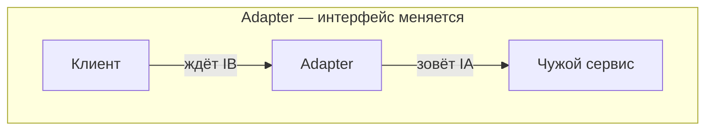
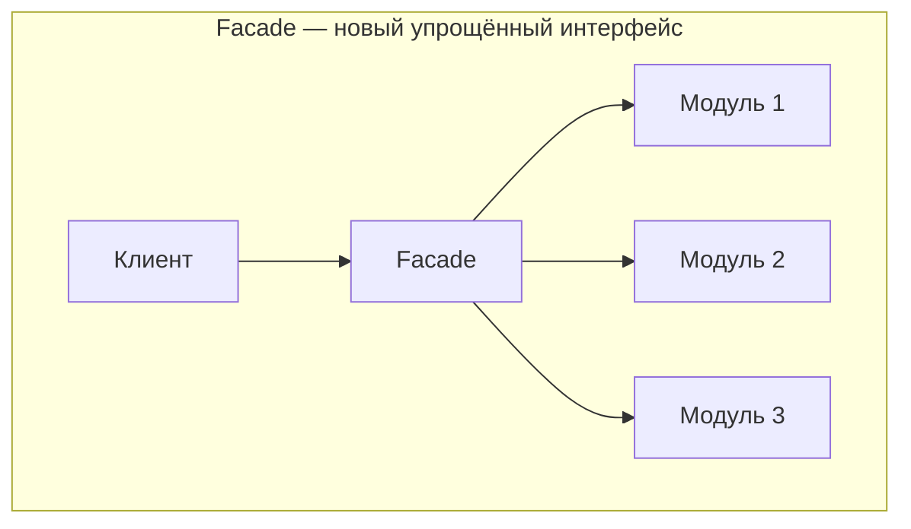
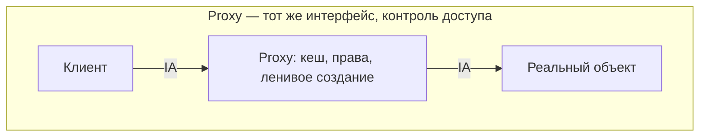
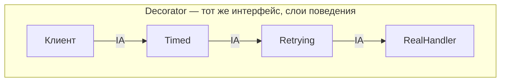
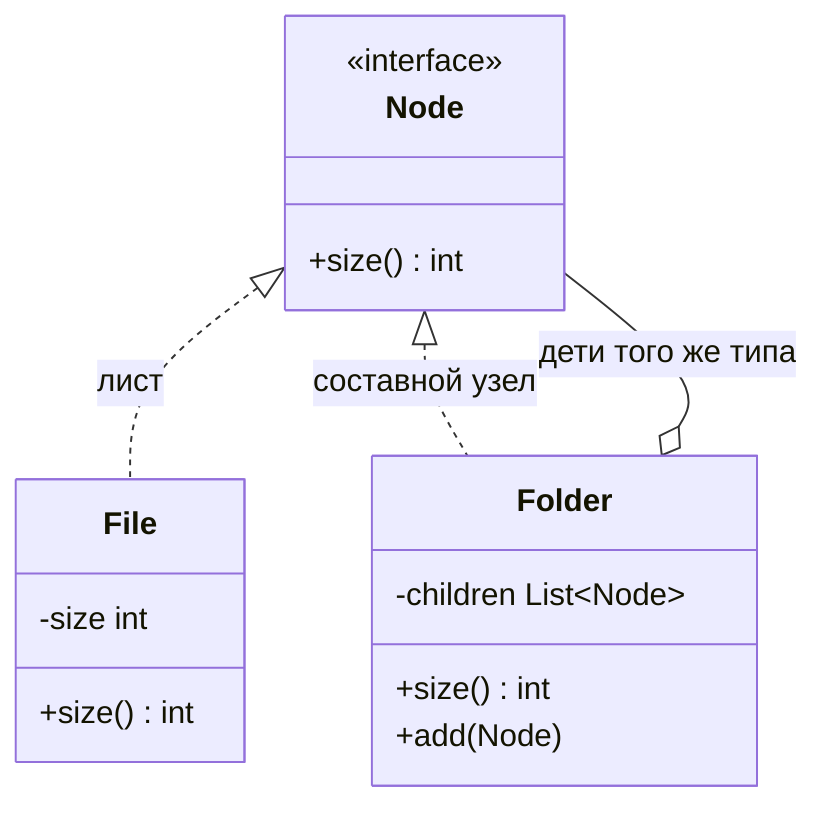
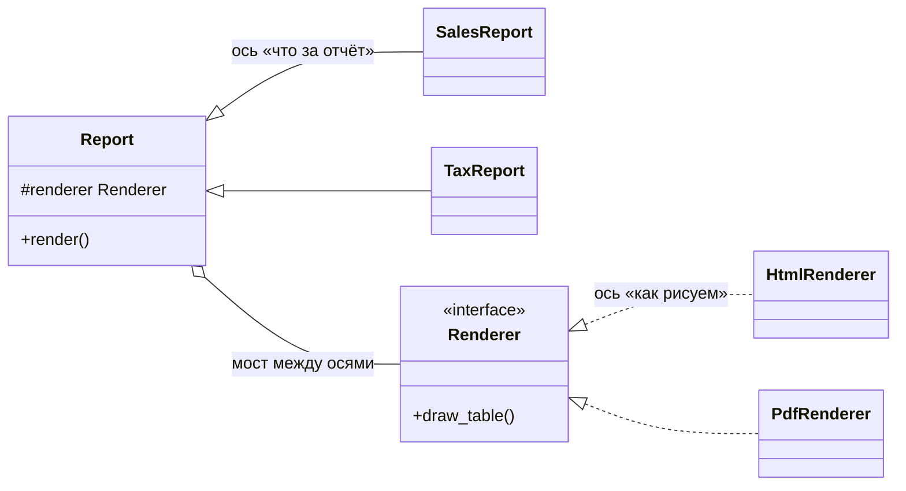

# Структурные паттерны

[← Порождающие паттерны](patterns-creational.md) · [🏠 Домой](../README.md) · [Поведенческие паттерны →](patterns-behavioral.md)

---

## Adapter, Facade, Proxy, Decorator — в чём разница?

**Коротко.** Все четыре оборачивают другой объект, но с разными намерениями:
Adapter **меняет интерфейс** под ожидания клиента; Facade **упрощает** доступ
к сложной подсистеме; Proxy **сохраняет интерфейс** и контролирует доступ
(ленивая загрузка, кеш, права, удалённый вызов); Decorator **сохраняет
интерфейс** и добавляет поведение, причём его можно накладывать слоями.

| Паттерн | Интерфейс на выходе | Зачем |
|---|---|---|
| Adapter | другой | подружить несовместимое |
| Facade | новый упрощённый | спрятать сложность подсистемы |
| Proxy | тот же | контроль доступа к объекту |
| Decorator | тот же | добавить обязанность, слоями |









```python
class Timed:                      # decorator: интерфейс тот же, поведение шире
    def __init__(self, inner):
        self._inner = inner
    def handle(self, req):
        start = perf_counter()
        try:
            return self._inner.handle(req)
        finally:
            log.info("handled in %.3fs", perf_counter() - start)

handler = Timed(Retrying(RealHandler()))     # слои складываются
```

**Подвох.** Proxy и Decorator структурно почти совпадают — их различают по
намерению и по тому, кто владеет объектом. Proxy обычно сам управляет
временем жизни цели (создаёт по требованию), Decorator получает готовый объект
снаружи и не решает, существует ли он.

**Глубже.** Facade не запрещает доступ к подсистеме напрямую — он предлагает
удобный путь для типового сценария. Если фасад стал единственным входом и
разросся, он превращается в god object; лечится разделением по сценариям
использования.

**В Python:** синтаксис `@decorator` — это не паттерн Decorator из GoF, а
языковая конструкция для оборачивания функций и классов; сходство есть, но
разбирать нужно отдельно: [декораторы](../python/decorators.md). Контекстные
менеджеры как способ обернуть ресурс —
[контекстные менеджеры](../python/context-managers.md).

---

## Composite

**Коротко.** Composite позволяет обращаться к дереву объектов и к отдельному
объекту одинаково: лист и составной узел реализуют один интерфейс, и клиент
не различает их. Применяется для иерархий вида «файлы и папки», «группа фигур»,
«вложенные меню», «дерево прав».



```python
class Node(Protocol):
    def size(self) -> int: ...

class File:
    def __init__(self, size: int) -> None: self._size = size
    def size(self) -> int: return self._size

class Folder:
    def __init__(self, children: list[Node]) -> None: self._children = children
    def size(self) -> int:
        return sum(c.size() for c in self._children)   # рекурсия по дереву
```

**Подвох.** Общий интерфейс тянет в лист методы, которые ему не нужны
(`add`/`remove` ребёнка). GoF предлагает компромисс: либо объявить их в базовом
типе и бросать ошибку в листе (нарушение [LSP](solid.md)), либо держать их
только в составном узле (тогда клиент вынужден различать типы). Второй вариант
обычно честнее.

**Глубже.** Рекурсивный обход глубокого дерева упирается в лимит стека —
для больших структур обход разворачивают в явный стек или очередь. Отдельная
опасность — циклы: дерево, где узел стал собственным потомком, зациклит любой
наивный обход.

**В SQL:** хранение деревьев (adjacency list, materialized path, nested sets)
и рекурсивные запросы — смежная тема к
[нормализации](../sql/normalization.md) и [JOIN](../sql/joins.md).

---

## Flyweight и Bridge

**Коротко.** Flyweight экономит память, разделяя одинаковое (внутреннее)
состояние между множеством объектов и вынося различающееся (внешнее) в
параметры вызова. Bridge разделяет абстракцию и реализацию по двум независимым
осям изменений, чтобы не плодить классы на каждое сочетание.

Flyweight классически применяют к символам в текстовом редакторе, тайлам
в игре, повторяющимся строкам. Bridge — когда есть, например, три вида отчётов
и три способа их отрисовки: наследование дало бы девять классов, мост даёт
три плюс три.



**Подвох.** Flyweight работает только с **неизменяемым** разделяемым
состоянием: если общий объект можно поменять, изменение мгновенно увидят все
владельцы. Это же объясняет, почему интернирование строк безопасно в языках
с иммутабельными строками и опасно без них.

**Глубже.** Bridge и Strategy выглядят одинаково (оба держат ссылку на
интерфейс), но Bridge — структурное решение на этапе проектирования иерархии,
а Strategy — поведенческое, подменяемое в рантайме.

**В Python:** интернирование малых `int` и строк, разделяемая память объектов
и `__slots__` для экономии — [управление памятью](../python/memory-management.md)
и [ООП вглубь](../python/oop-advanced.md); неизменяемость строк —
[str](../python/str.md).

---

[← Порождающие паттерны](patterns-creational.md) · [🏠 Домой](../README.md) · [Поведенческие паттерны →](patterns-behavioral.md)
