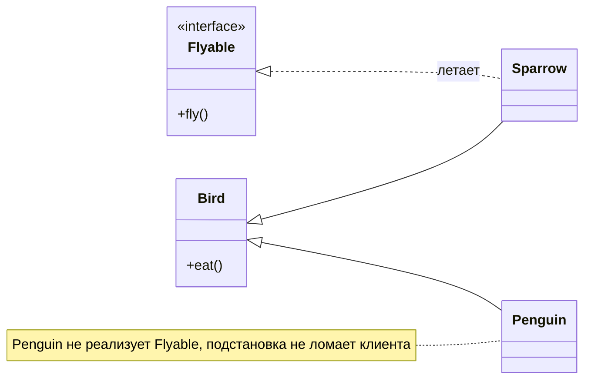
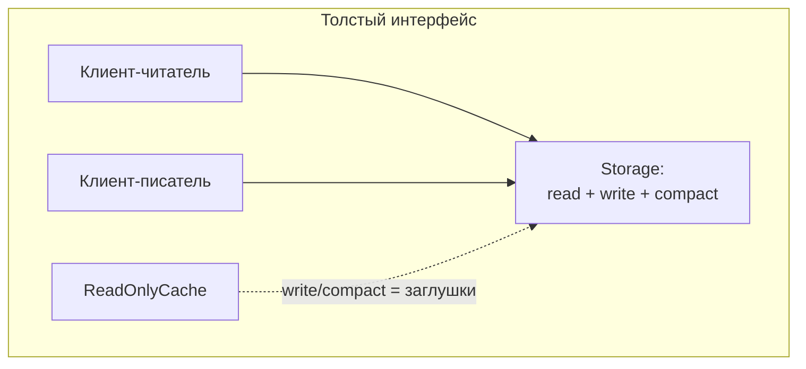
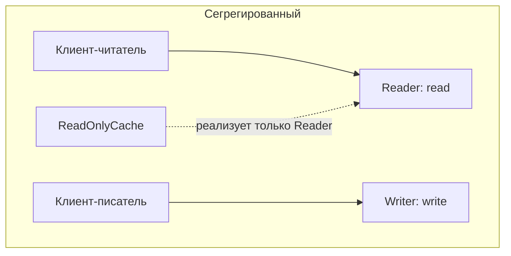
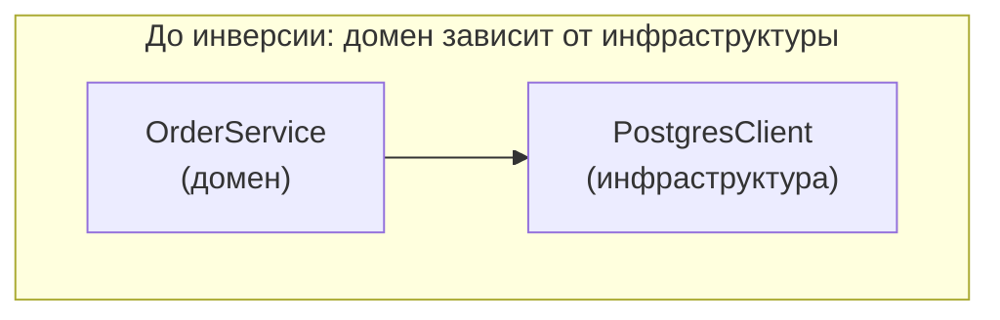
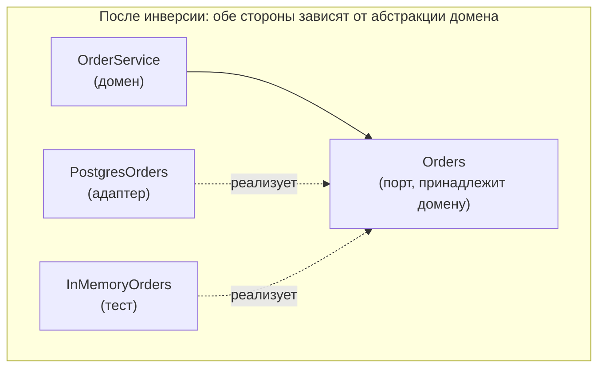

# SOLID

[← Связи между классами](oop-relations.md) · [🏠 Домой](../README.md) · [Внедрение зависимостей →](dependency-injection.md)

---

## Расскажите про SOLID

**Коротко.** Пять принципов проектирования классов и модулей: **S**ingle
responsibility — одна причина для изменения; **O**pen/closed — открыт для
расширения, закрыт для изменения; **L**iskov substitution — наследник
подставляется вместо базового типа без сюрпризов; **I**nterface segregation —
много узких интерфейсов лучше одного широкого; **D**ependency inversion —
зависеть от абстракций, а не от конкретных реализаций.

Общая цель всех пяти — сделать так, чтобы изменение требования затрагивало
одно место, а не расползалось по системе.

---

## S — Single Responsibility Principle

**Коротко.** У модуля должна быть одна причина для изменения. Формулировка
Роберта Мартина точнее школьной «класс делает одно дело»: класс должен
отвечать перед **одним заинтересованным лицом** — одним источником требований.

```python
# нарушение: три причины меняться — правила расчёта, формат отчёта, схема БД
class Employee:
    def calculate_pay(self): ...     # меняет бухгалтерия
    def report_hours(self): ...      # меняет отдел кадров
    def save(self): ...              # меняет DBA

# разделение по источникам требований
class PayCalculator: ...
class HoursReporter: ...
class EmployeeRepository: ...
```

**Подвох.** «Одна ответственность» часто вырождается в классы из одного метода
и десятки файлов — это тоже плохо, растёт связанность и падает читаемость.
Критерий — не размер, а **совместная изменяемость**: то, что меняется вместе,
должно лежать вместе.

---

## O — Open/Closed Principle

**Коротко.** Поведение системы расширяется добавлением нового кода, а не
правкой существующего. На практике — новые варианты подключаются через
реализацию интерфейса, а не через новую ветку в `if`/`switch`.

```python
# закрыто для расширения: каждый новый способ оплаты правит эту функцию
def pay(kind, amount):
    if kind == "card": ...
    elif kind == "sbp": ...

# открыто: новый способ — новый класс, старый код не трогаем
class PaymentMethod(Protocol):
    def pay(self, amount: int) -> None: ...

def checkout(method: PaymentMethod, amount: int) -> None:
    method.pay(amount)
```

**Подвох.** Принцип не запрещает править код — он запрещает править **готовый
и оттестированный** код ради нового варианта того же самого. Заранее делать
точки расширения «на будущее» вредно, это прямое нарушение
[YAGNI](principles.md): абстракцию вводят на втором-третьем случае, когда ось
изменений уже видна.

---

## L — Liskov Substitution Principle

**Коротко.** Если код работает с базовым типом, он должен корректно работать
с любым наследником, не зная об этом. Наследник не имеет права усиливать
предусловия и ослаблять постусловия.

Нарушения выглядят так: переопределённый метод бросает `NotImplementedError`;
наследник требует более узкий вход; наследник нарушает инвариант базового
класса (тот самый квадрат-прямоугольник); вызывающему приходится писать
`isinstance`, чтобы обработать «особенный» подкласс.

```python
class Bird:
    def fly(self) -> None: ...

class Penguin(Bird):
    def fly(self) -> None:
        raise NotImplementedError    # LSP нарушен: подстановка ломает вызывающего
```

Лечение — не наследовать `Penguin` от `Bird`, а вынести способность летать
в отдельный интерфейс `Flyable`: иерархия должна строиться по поведению,
а не по биологии.



**Глубже.** Формально LSP — про контракты (design by contract): предусловия
наследника не сильнее, постусловия не слабее, инварианты сохраняются, а
исключения — не шире объявленных базовым типом. Появление `isinstance`
в клиентском коде — надёжный индикатор нарушения.

---

## I — Interface Segregation Principle

**Коротко.** Клиента нельзя заставлять зависеть от методов, которые он не
использует. Толстый интерфейс делят на несколько узких по ролям клиентов.





```python
# толстый: реализация «только для чтения» вынуждена писать заглушки
class Storage(Protocol):
    def read(self, k: str) -> bytes: ...
    def write(self, k: str, v: bytes) -> None: ...
    def compact(self) -> None: ...

# сегрегированный
class Reader(Protocol):
    def read(self, k: str) -> bytes: ...
class Writer(Protocol):
    def write(self, k: str, v: bytes) -> None: ...
```

**Подвох.** ISP — это не «интерфейс не длиннее трёх методов». Делить нужно по
**группам клиентов**: если все пользователи интерфейса вызывают все его методы,
дробить нечего. Заглушки `pass` и `NotImplementedError` в реализациях —
сигнал, что интерфейс толще, чем нужно.

---

## D — Dependency Inversion Principle

**Коротко.** Модули верхнего уровня не должны зависеть от модулей нижнего
уровня; оба зависят от абстракций. Причём **абстракцию определяет верхний
уровень** — именно в этом «инверсия».





Стрелка зависимости у адаптера направлена против направления вызова — в этом
и состоит инверсия.

```python
# прямая зависимость: домен знает про Postgres
class OrderService:
    def __init__(self) -> None:
        self.db = PostgresClient()          # намертво

# инвертированная: домен объявляет, что ему нужно, реализацию получает снаружи
class Orders(Protocol):
    def save(self, order: "Order") -> None: ...

class OrderService:
    def __init__(self, orders: Orders) -> None:
        self.orders = orders                # dependency injection
```

**Подвох.** DIP путают с [dependency injection](dependency-injection.md).
DI — техника (передать зависимость в конструктор вместо создания внутри),
DIP — принцип направления зависимостей. Можно внедрять зависимость через конструктор и всё равно
нарушать DIP — если тип параметра это конкретный `PostgresClient`, а не
абстракция, объявленная доменом.

**Глубже.** DIP — фундамент [гексагональной архитектуры](architecture.md):
интерфейс (порт) принадлежит домену, реализация (адаптер) — инфраструктуре,
и стрелка зависимости на схеме компонентов разворачивается против направления
вызова. Побочный выигрыш — тестируемость: в тесте подставляется
in-memory реализация вместо базы.

---

**В Python:** протоколы и структурная типизация для O/I/D —
[базовый `typing`](../python/typing-basics.md);
`ABC`, MRO и переопределение методов для L — [ООП вглубь](../python/oop-advanced.md);
декоратор `@override` (3.12+), защищающий от «переопределения в никуда», —
[тайпинг: дженерики, `Self`, `override`](../python/typing-advanced.md).

---

[← Связи между классами](oop-relations.md) · [🏠 Домой](../README.md) · [Внедрение зависимостей →](dependency-injection.md)
