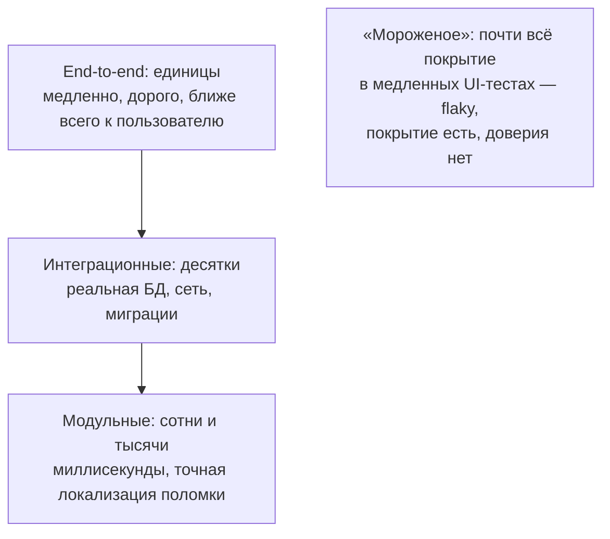

# Тестирование

[← Конкурентность и параллелизм](concurrency.md) · [🏠 Домой](../README.md)

---

## Какие бывают виды тестов и что такое пирамида тестирования?

**Коротко.** Пирамида: много быстрых модульных тестов внизу, меньше
интеграционных посередине, единицы end-to-end наверху. Чем выше уровень,
тем ближе тест к реальному сценарию и тем он медленнее, дороже в поддержке
и менее точно указывает на причину поломки.



- **Модульный (unit)** — проверяет одну единицу логики в изоляции, без БД
  и сети, за миллисекунды.
- **Интеграционный** — проверяет связку с реальной зависимостью: запрос
  действительно уходит в базу, миграции применяются, сериализация работает.
- **End-to-end** — сценарий целиком, через настоящий интерфейс, как у
  пользователя.
- Отдельно: нагрузочные, контрактные (совместимость API между сервисами),
  регрессионные, приёмочные.

**Подвох.** Перевёрнутая пирамида («мороженое») — когда почти всё покрытие
даётся медленными UI-тестами. Такой набор долго идёт, часто падает по
посторонним причинам (flaky-тесты), и в итоге его перестают чинить и начинают
игнорировать: покрытие формально есть, доверия нет.

**Глубже.** Тест должен падать по одной причине — из-за поломки поведения,
которое он проверяет. Отсюда правило: проверять **наблюдаемое поведение,
а не реализацию**. Тест, который ломается при каждом рефакторинге без
изменения поведения, вреден — он превращает
[рефакторинг](antipatterns-refactoring.md) из дешёвой операции в дорогую.

---

## Что такое mock, stub, fake и spy?

**Коротко.** Всё это тестовые дублёры (test doubles), различающиеся ролью.
**Stub** возвращает заранее заданные ответы. **Fake** — упрощённая рабочая
реализация (in-memory репозиторий вместо БД). **Spy** записывает, как его
вызывали, чтобы проверить это после. **Mock** — дублёр с заранее заданными
ожиданиями вызовов, который сам проваливает тест при их нарушении.

```python
class InMemoryOrders:            # fake: работает по-настоящему, но в памяти
    def __init__(self) -> None:
        self._data: dict[int, object] = {}
    def save(self, order) -> None:
        self._data[order.id] = order
    def get(self, order_id: int):
        return self._data[order_id]

# stub: просто отдаёт заранее заданный ответ, ничего не проверяет
class StubClock:
    def now(self) -> str:
        return "2026-01-01T00:00:00"

# mock: заранее знает, что должно быть вызвано, и проваливает тест сам
from unittest.mock import Mock

mailer = Mock()
send_welcome_email(user, mailer=mailer)
mailer.send.assert_called_once_with(to=user.email, template="welcome")
```

**Подвох.** Различают проверку **состояния** (после операции результат такой)
и **взаимодействия** (был вызван такой-то метод с такими аргументами).
Проверка взаимодействий привязывает тест к реализации: поменяли способ вызова,
не меняя поведения, — тест упал. Практическое правило: подменять то, что
пересекает границу системы (внешний API, отправка письма), и не подменять
внутренности собственного домена.

**Глубже.** Дублёр внешнего сервиса всегда рискует разойтись с реальностью:
контракт поменялся, а мок остался прежним, и тесты зелёные при сломанной
интеграции. Против этого работают контрактные тесты и запуск реальных
зависимостей в контейнерах на интеграционном уровне.

---

## Что такое TDD и покрытие кода?

**Коротко.** TDD — цикл red / green / refactor: сначала падающий тест, затем
минимальный код, чтобы он прошёл, затем рефакторинг при зелёных тестах.
Ценность не столько в тестах, сколько в давлении на дизайн: код, который
трудно протестировать, обычно имеет слишком много зависимостей и
ответственностей.

Покрытие (coverage) — доля кода, исполненного тестами: по строкам, по ветвям,
по условиям. Это **индикатор, а не цель**: 100% покрытия достигается тестами
вообще без утверждений. Покрытие полезно тем, что показывает *непокрытое*;
выводить из него качество нельзя.

**Подвох.** Требование «покрытие не ниже N%» на CI провоцирует писать тесты
на тривиальные геттеры вместо тестов на сложные ветвления. Более осмысленная
метрика — покрытие **изменённого кода** в pull request и отсутствие
непроверенных ветвей в критичной логике.

**Глубже.** Качество набора тестов измеряют мутационным тестированием:
инструмент вносит в код мелкие изменения (меняет `>` на `>=`, удаляет строку)
и смотрит, упадут ли тесты. Выжившая мутация означает, что участок
исполняется, но не проверяется. Свойства хорошего теста сводят к FIRST:
быстрый, независимый, воспроизводимый, самопроверяющийся, написанный вовремя.

Отдельный подход — **property-based тестирование** (в Python — Hypothesis,
аналог QuickCheck): вместо того чтобы придумывать конкретные примеры входных
данных, задают **свойство**, которое должно выполняться для любых входов
(«сортировка идемпотентна: `sort(sort(x)) == sort(x)`»), а фреймворк сам
генерирует случайные и граничные значения, пытаясь найти контрпример. Это
особенно хорошо ловит edge case'ы, о которых автор теста просто не подумал.

**В Python:** отладка и инструментарий разработчика —
[инструменты разработчика](../python/dev-tools.md); статическая проверка,
дополняющая тесты, — [базовый `typing`](../python/typing-basics.md);
подмена ресурсов на время теста через контекстные менеджеры —
[контекстные менеджеры](../python/context-managers.md).

---

[← Конкурентность и параллелизм](concurrency.md) · [🏠 Домой](../README.md)
