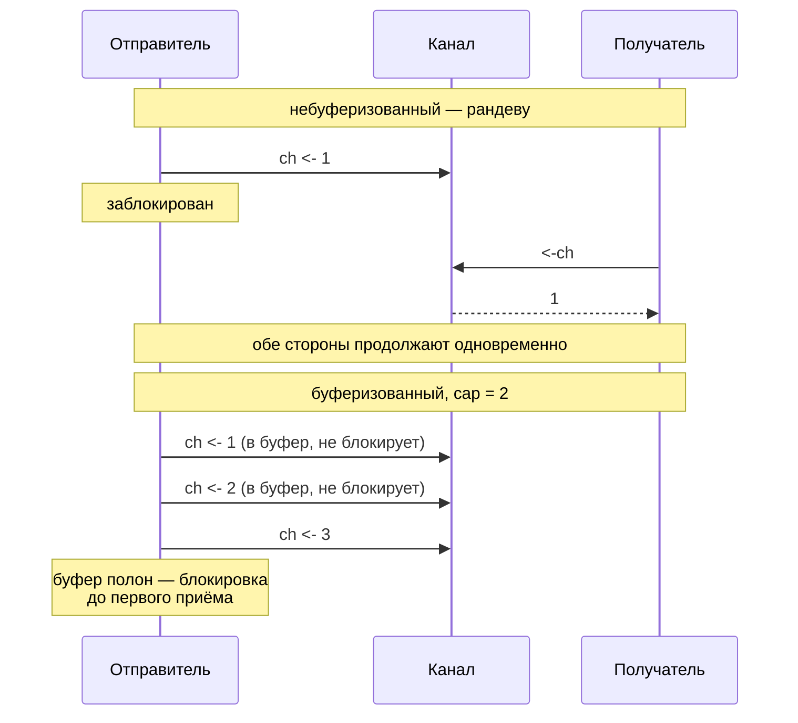

# Каналы и select

[← Горутины и планировщик](goroutines-scheduler.md) · [🏠 Домой](../README.md) · [sync, atomic и модель памяти →](sync-atomic.md)

---

## Чем небуферизованный канал отличается от буферизованного?

**Коротко.** Небуферизованный канал синхронный: отправка блокируется, пока
кто-то не начнёт приём, — это точка рандеву и одновременно гарантия
happens-before между отправителем и получателем. Буферизованный канал
блокирует отправку только тогда, когда буфер полон, а приём — когда он пуст.



```go
package main

import "fmt"

func main() {
	unbuf := make(chan int) // без буфера
	go func() {
		unbuf <- 1 // заблокируется, пока main не начнёт читать
	}()
	fmt.Println(<-unbuf) // 1

	buf := make(chan int, 2)
	buf <- 1 // не блокирует — есть свободное место
	buf <- 2 // тоже не блокирует
	// buf <- 3 // заблокировало бы: буфер полон
	fmt.Println(<-buf, <-buf) // 1 2
}
```

Девиз пакета `sync` в контексте каналов часто цитируют неточно: «не
общайтесь через разделяемую память — делите память через общение» — но в
стандартной библиотеке мьютексы используются не реже каналов. Канал хорош
для передачи владения данными и координации; мьютекс — для защиты общего
состояния на месте. Одно не отменяет другого.

**Подвох.** Наличие буфера не отменяет синхронизацию — она просто сдвигается
по времени. `buf <- 1` "успевает" раньше, чем кто-то прочитает, но это не
значит, что можно писать в буферизованный канал бесконечно без читателя:
как только буфер заполнится, отправитель заблокируется точно так же, как
на небуферизованном.

---

## Что происходит при операциях с `nil`-каналом и с закрытым каналом?

**Коротко.** Это одна из самых частых табличных проверок на собеседовании —
поведение принципиально разное и его стоит помнить наизусть.

| Операция | `nil`-канал | закрытый канал |
|---|---|---|
| чтение | блокируется навсегда | сразу отдаёт zero value, `ok == false` |
| запись | блокируется навсегда | **паника** |
| `close` | паника | **паника** |

```go
func main() {
	ch := make(chan int, 2)
	ch <- 10
	close(ch)

	v, ok := <-ch
	fmt.Println(v, ok) // 10 true — в буфере ещё было значение

	v, ok = <-ch
	fmt.Println(v, ok) // 0 false — канал закрыт и пуст

	defer func() {
		if r := recover(); r != nil {
			fmt.Println("recovered:", r) // send on closed channel
		}
	}()
	ch <- 1 // паника: отправка в закрытый канал
}
```

`v, ok := <-ch` — единственный надёжный способ отличить «пришло реальное
значение» от «канал закрыт и вернул zero value». Форма `for v := range ch`
делает то же самое неявно: цикл просто завершается, когда канал закрыт и
пуст.

**Подвох.** Закрывает канал всегда отправитель (или единственный владелец),
и делает это **однократно** — повторный `close` паникует так же, как запись
в закрытый канал. Закрытие — это broadcast «данных больше не будет», а не
«освободить ресурс»: закрывать канал ради сборщика мусора не нужно, он и так
будет собран, когда не останется ссылок.

---

## Как реализовать таймаут и отмену через `select`?

**Коротко.** `select` ждёт первый готовый `case`; если несколько готовы
одновременно, выбор происходит **случайно** — это защита от голодания одной
из веток. Таймаут и отмена обычно приходят как ещё один `case`:
`case <-time.After(d)` или `case <-ctx.Done()`.

```go
func fetchWithTimeout(ctx context.Context, url string) (string, error) {
	result := make(chan string, 1) // буфер 1 — горутина не зависнет, даже если сюда не вернутся
	go func() {
		time.Sleep(200 * time.Millisecond) // имитация медленного запроса
		result <- "response from " + url
	}()

	select {
	case r := <-result:
		return r, nil
	case <-ctx.Done():
		return "", ctx.Err()
	}
}

func main() {
	ctx, cancel := context.WithTimeout(context.Background(), 50*time.Millisecond)
	defer cancel()

	_, err := fetchWithTimeout(ctx, "example.com")
	fmt.Println(err) // context deadline exceeded
}
```

Обратите внимание на буфер размера 1 у `result`: без него, если `select`
завершится по таймауту, горутина-отправитель зависнет навсегда, пытаясь
записать в канал, который больше никто не читает, — это и есть утечка
горутины на ровном месте.

**Подвох.** `time.After` удобен, но аллоцирует новый таймер при **каждом**
вызове — в цикле (например, внутри `for-select`) это течёт память и таймеры
до срабатывания. В горячем пути правильнее завести один
`time.NewTimer`/`time.NewTicker` и явно вызывать `Stop()`/`Reset()`.

---

## Кто должен закрывать канал, если пишут в него несколько горутин?

**Коротко.** Закрывать канал с несколькими независимыми отправителями
напрямую нельзя — второй `close` или запись после закрытия запаникуют.
Стандартная идиома — дождаться завершения всех отправителей через
`sync.WaitGroup` и закрыть выходной канал уже из отдельной горутины,
после `wg.Wait()`.

```go
func merge(cs ...<-chan int) <-chan int {
	out := make(chan int)
	var wg sync.WaitGroup
	wg.Add(len(cs))
	for _, c := range cs {
		go func(c <-chan int) {
			defer wg.Done()
			for v := range c {
				out <- v
			}
		}(c)
	}
	go func() {
		wg.Wait()
		close(out) // закрывает единственный "владелец" — после того как все писатели закончили
	}()
	return out
}
```

**Подвох.** Правило в одну фразу: закрывает канал тот, кто пишет, а не тот,
кто читает. Если у канала несколько читателей, а не писателей — закрытие
корректно в любой момент, потому что `close` — это широковещательный сигнал
всем ожидающим, а не операция, которая должна быть согласована с чтением.

---

## Как `select` выбирает между несколькими готовыми `case`, и как временно "выключить" одну из веток?

**Коротко.** Если готовы несколько `case`, `select` выбирает один из них
**псевдослучайно** — полагаться на порядок объявления веток нельзя.
`default` делает всю конструкцию неблокирующей, а `select {}` без единого
`case` блокируется навсегда. Отдельный приём — `case` с `nil`-каналом
никогда не станет готовым, что позволяет динамически "выключать" ветку.

```go
func main() {
	a := make(chan int, 1)
	b := make(chan int, 1)
	a <- 1
	b <- 2

	select {
	case v := <-a:
		fmt.Println("a:", v)
	case v := <-b:
		fmt.Println("b:", v)
		// оба case готовы одновременно — какой сработает, решает рантайм
	}

	var disabled chan int // nil-канал: этот case никогда не станет готовым
	timeout := time.After(10 * time.Millisecond)
	select {
	case <-disabled:
		fmt.Println("недостижимо")
	case <-timeout:
		fmt.Println("timeout fired")
	}
}
```

**Глубже.** Присвоение переменной канала значения `nil` внутри `for-select`
— рабочий способ один раз обработать событие и больше не подставлять его в
выбор: после первого срабатывания `case` можно занулить сам канал, и
дальнейшие итерации `select` эту ветку просто игнорируют, не трогая логику
остальных `case`. Учитывайте и цену: канал внутри — это мьютекс, кольцевой
буфер и очередь ожидающих горутин, поэтому там, где достаточно простого
счётчика, `sync/atomic` в разы дешевле канала.

---

[← Горутины и планировщик](goroutines-scheduler.md) · [🏠 Домой](../README.md) · [sync, atomic и модель памяти →](sync-atomic.md)
