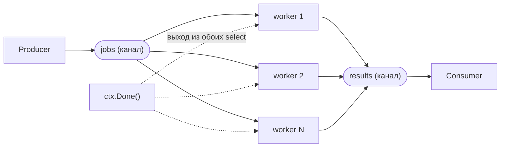
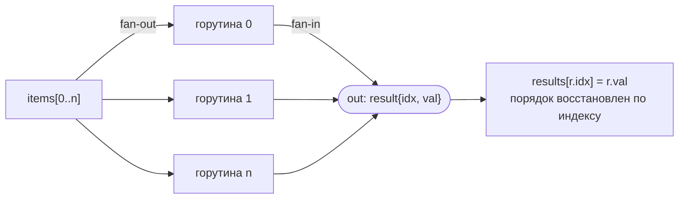
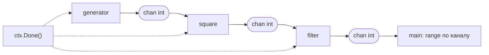
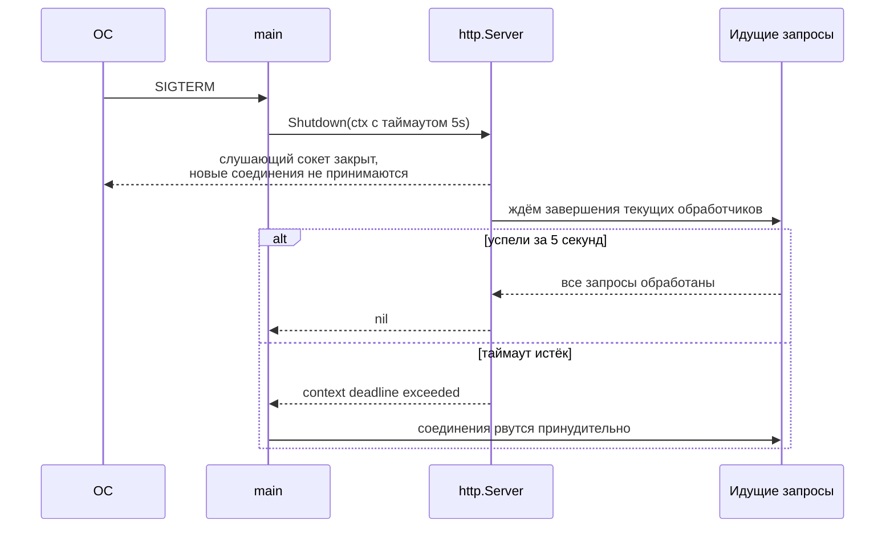

# Паттерны конкурентности

[← context.Context](context.md) · [🏠 Домой](../README.md) · [Память, стек, куча, GC →](memory-gc.md)

---

## Как реализовать worker pool, и сколько воркеров заводить?

**Коротко.** N горутин читают задачи из общего входного канала и пишут
результаты в выходной; число воркеров ограничивает и параллелизм, и
потребление ресурсов. Правильное число зависит от природы нагрузки:
CPU-bound задачи — около `GOMAXPROCS`, I/O-bound — заметно больше, потому
что воркер большую часть времени не занимает ядро, а ждёт сеть или диск.



```go
func workerPool(ctx context.Context, jobs <-chan int, workers int) <-chan int {
	results := make(chan int)
	var wg sync.WaitGroup
	wg.Add(workers)
	for i := 0; i < workers; i++ {
		go func() {
			defer wg.Done()
			for {
				select {
				case job, ok := <-jobs:
					if !ok {
						return // канал задач закрыт — воркеру больше нечего делать
					}
					select {
					case results <- job * job:
					case <-ctx.Done():
						return
					}
				case <-ctx.Done():
					return
				}
			}
		}()
	}
	go func() {
		wg.Wait()
		close(results) // закрывает единственный "владелец" — после завершения всех воркеров
	}()
	return results
}
```

**Подвох.** Внешний `select` с `ctx.Done()` нужен на **обоих** уровнях —
и при чтении из `jobs`, и при записи в `results`. Если оставить только
`case job, ok := <-jobs`, воркер может успешно достать задачу, но
безнадёжно зависнуть на записи результата, если читатель `results` уже
ушёл по таймауту, — классическая утечка горутины даже внутри "правильного"
пула.

---

## Что такое fan-out/fan-in, и как собрать результаты в исходном порядке?

**Коротко.** Fan-out — раздать одну работу нескольким горутинам, fan-in —
собрать их результаты обратно в один канал. Порядок прихода результатов из
такого канала не гарантирован, поэтому если исходный порядок важен, задачи
индексируют и складывают результаты в слайс по индексу, а не по времени
прихода.



```go
func fanOutIn(items []string) ([]int, error) {
	type result struct {
		idx int
		val int
	}
	out := make(chan result, len(items))

	var wg sync.WaitGroup
	for i, item := range items {
		wg.Add(1)
		go func(i int, item string) {
			defer wg.Done()
			out <- result{idx: i, val: len(item)} // имитация обработки
		}(i, item)
	}
	go func() {
		wg.Wait()
		close(out)
	}()

	results := make([]int, len(items))
	for r := range out {
		results[r.idx] = r.val // складываем по индексу задачи, а не по порядку прихода
	}
	return results, nil
}
```

**Подвох.** Про закрытие `out` здесь легко ошибиться дважды: закрывать его
может только один "владелец" (не каждая из горутин по очереди), и делать
это нужно строго после `wg.Wait()` — иначе `range out` в основной горутине
завершится раньше, чем придут последние результаты.

---

## Как построить pipeline из нескольких стадий с корректной отменой?

**Коротко.** Pipeline — это цепочка стадий, каждая из которых — горутина,
читающая из входного канала и пишущая в выходной. Ключевое правило: **каждая
стадия обязана корректно завершиться при отмене**, иначе течёт вся цепочка
горутин целиком, а не только последняя.



Каждая стадия закрывает **свой** выходной канал через `defer close(out)` —
закрытие идёт по цепочке слева направо и завершает `range` у следующей стадии.

```go
func generator(ctx context.Context, nums ...int) <-chan int {
	out := make(chan int)
	go func() {
		defer close(out)
		for _, n := range nums {
			select {
			case out <- n:
			case <-ctx.Done():
				return // стадия обязана прекратить работу при отмене
			}
		}
	}()
	return out
}

func square(ctx context.Context, in <-chan int) <-chan int {
	out := make(chan int)
	go func() {
		defer close(out)
		for n := range in {
			select {
			case out <- n * n:
			case <-ctx.Done():
				return
			}
		}
	}()
	return out
}

func main() {
	ctx, cancel := context.WithCancel(context.Background())
	defer cancel()

	for v := range square(ctx, generator(ctx, 1, 2, 3, 4)) {
		fmt.Println(v)
		if v == 4 {
			cancel() // остальные стадии корректно остановятся по ctx.Done()
			break
		}
	}
}
```

**Подвох.** Если хотя бы одна стадия читает `in` без `select` с
`ctx.Done()` (просто `for n := range in`), она переживёт отмену и будет
ждать закрытия входного канала — а он закроется, только когда закроется
`generator`, который тоже ждёт отмены. Одна незащищённая стадия ломает
отмену всего пайплайна.

---

## Как `errgroup` упрощает запуск группы горутин с общей ошибкой и отменой?

**Коротко.** `golang.org/x/sync/errgroup` — практический стандарт для
"запустить несколько горутин, дождаться всех, вернуть первую ошибку".
`g.Wait()` возвращает первую полученную ошибку и автоматически отменяет
общий контекст, чтобы остальные горутины могли остановиться раньше времени;
`g.SetLimit(n)` ограничивает параллелизм без отдельного семафора.

```go
import "golang.org/x/sync/errgroup"

func fetchAll(ctx context.Context, urls []string) ([]string, error) {
	g, ctx := errgroup.WithContext(ctx)
	g.SetLimit(4) // не больше 4 одновременных запросов

	results := make([]string, len(urls))
	for i, url := range urls {
		// go 1.22+: у переменной цикла своя копия на каждой итерации,
		// i, url := i, url больше не нужны
		g.Go(func() error {
			body, err := fetch(ctx, url)
			if err != nil {
				return err // первая ошибка отменит общий ctx и остановит остальных
			}
			results[i] = body
			return nil
		})
	}
	if err := g.Wait(); err != nil {
		return nil, err
	}
	return results, nil
}
```

**Подвох.** `errgroup` отменяет контекст при первой ошибке, но не
прерывает уже выполняющиеся горутины принудительно — как и с обычным
`context`, каждая из них обязана сама проверять `ctx.Err()` или
`ctx.Done()`, иначе продолжит работать вхолостую после того, как результат
уже никому не нужен.

---

## Как ограничить параллелизм без отдельного пула воркеров?

**Коротко.** Простой семафор на буферизованном канале `chan struct{}` —
самый компактный способ ограничить, сколько горутин одновременно занимаются
работой, без отдельной инфраструктуры пула.

```go
func processAll(items []string) {
	sem := make(chan struct{}, 3) // не более 3 одновременно
	var wg sync.WaitGroup
	for _, item := range items {
		wg.Add(1)
		sem <- struct{}{} // занять слот (заблокируется, если все 3 заняты)
		go func(item string) {
			defer wg.Done()
			defer func() { <-sem }() // освободить слот
			process(item)
		}(item)
	}
	wg.Wait()
}

func process(item string) { _ = item }
```

Для более развитых сценариев (например, взвешенный семафор с разным весом
задач) есть готовый `golang.org/x/sync/semaphore`.

**Подвох.** `sem <- struct{}{}` вызывается **до** `go func(...)`, в основной
горутине — так параллелизм ограничен честно. Если вместо этого занимать
слот уже внутри запущенной горутины, все `items` успеют запуститься сразу
(просто заблокируются на семафоре), и цель "не плодить горутины сверх меры"
не достигается — они всё равно все будут созданы одновременно.

---

## Как устроен graceful shutdown HTTP-сервера?

**Коротко.** Связка `signal.NotifyContext` + `Server.Shutdown` — стандартный
способ дождаться сигнала ОС (`SIGINT`/`SIGTERM`), перестать принимать новые
соединения и корректно долить обработку уже идущих запросов в пределах
таймаута.



```go
func main() {
	ctx, stop := signal.NotifyContext(context.Background(), os.Interrupt, syscall.SIGTERM)
	defer stop()

	srv := &http.Server{Addr: ":8080"}
	go func() {
		if err := srv.ListenAndServe(); err != nil && err != http.ErrServerClosed {
			log.Fatal(err)
		}
	}()

	<-ctx.Done() // получен сигнал остановки
	stop()       // перестать перехватывать повторный Ctrl+C

	shutdownCtx, cancel := context.WithTimeout(context.Background(), 5*time.Second)
	defer cancel()
	if err := srv.Shutdown(shutdownCtx); err != nil {
		log.Println("forced shutdown:", err)
	}
}
```

**Глубже.** Тот же принцип масштабируется на любой фоновый сервис, не
только HTTP: перестать принимать новую работу, дать текущей завершиться в
пределах таймаута, а по истечении таймаута — прервать принудительно, залогировав
это отдельно от штатного пути. Сюда же относится `singleflight`
(`golang.org/x/sync/singleflight`) — схлопывание одновременных одинаковых
запросов в один вызов, что особенно полезно как раз при пиковой нагрузке
перед остановкой (защита от cache stampede), и `golang.org/x/time/rate` для
ограничения RPS, что стоит отличать от ограничения параллелизма семафором
выше: RPS ограничивает частоту запуска новой работы во времени, семафор —
число одновременно выполняющихся задач.

---

[← context.Context](context.md) · [🏠 Домой](../README.md) · [Память, стек, куча, GC →](memory-gc.md)
