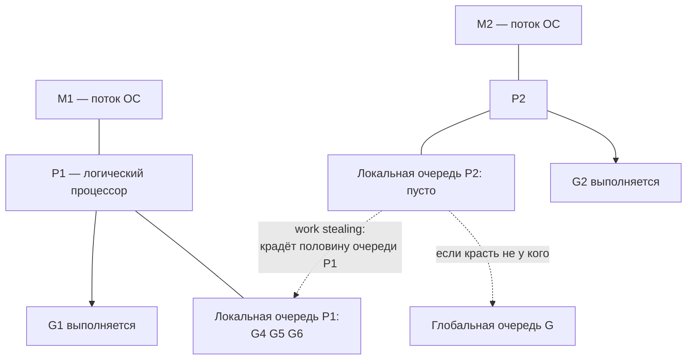
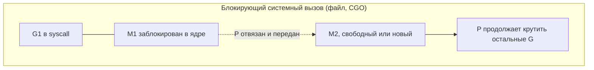
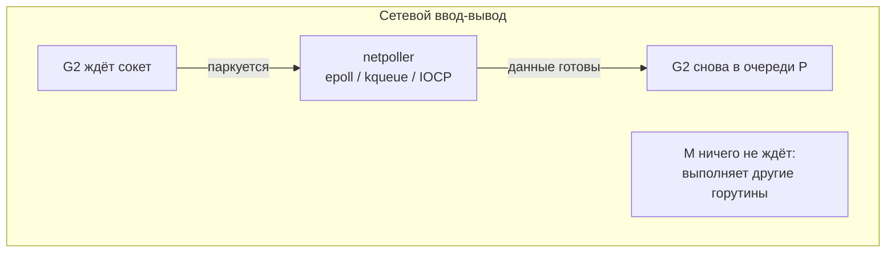

# Горутины и планировщик

[← defer, panic, recover](defer-panic-recover.md) · [🏠 Домой](../README.md) · [Каналы и select →](channels-select.md)

---

## Чем горутина отличается от потока ОС, и почему "миллион горутин" — нормальная ситуация?

**Коротко.** Горутина — не поток ОС, а лёгкая корутина, которую
мультиплексирует рантайм Go. Стартовый стек — около 2 КБ и растёт/сжимается
динамически (copying stacks), тогда как поток ОС резервирует под стек
мегабайты. Отсюда десятки и сотни тысяч горутин в одном процессе — обычная
нагрузка, а не экзотика.

```go
package main

import (
	"fmt"
	"sync"
	"time"
)

func main() {
	var wg sync.WaitGroup
	for i := 0; i < 100_000; i++ {
		wg.Add(1)
		go func() {
			defer wg.Done()
			time.Sleep(time.Millisecond)
		}()
	}
	wg.Wait()
	fmt.Println("done")
	// 100 000 горутин — обычная нагрузка; столько потоков ОС уже была бы проблема
}
```

**Подвох.** «Горутина — это просто lightweight thread» — упрощение, которое
на собеседовании стоит уточнить. У горутины нет идентификатора и нет
"родителя" — это сознательное решение: убить чужую горутину извне нельзя,
только просигналить ей через канал или `context`, а завершиться она должна
сама.

---

## Что такое модель GMP и как работает work stealing?

**Коротко.** Планировщик Go устроен как **G-M-P**: **G** (goroutine) — сама
горутина со своим стеком и состоянием; **M** (machine) — поток ОС; **P**
(processor) — логический контекст выполнения с собственной локальной
очередью горутин. Выполнение возможно только в связке `M+P`, а число `P`
задаётся `GOMAXPROCS` (по умолчанию равно числу ядер).

Когда локальная очередь одного `P` пуста, а у соседнего есть работа,
простаивающий `P` **крадёт** половину его очереди — это и есть work
stealing; есть также глобальная очередь на случай, если красть не у кого.



```go
package main

import (
	"fmt"
	"runtime"
)

func main() {
	fmt.Println("GOMAXPROCS:", runtime.GOMAXPROCS(0))
	fmt.Println("goroutines at start:", runtime.NumGoroutine())
	// GOMAXPROCS: 8   (например, для 8-ядерной машины)
	// goroutines at start: 1
}
```

**Подвох.** `GOMAXPROCS` ограничивает **параллелизм** (сколько горутин
выполняется физически одновременно), а не их число — горутин может быть
миллион при `GOMAXPROCS=1`, просто они будут по очереди делить одно
ядро. В контейнерах рантайм по умолчанию видит весь хост, а не cgroup-лимит
— отсюда практика ставить `GOMAXPROCS` явно или использовать
`go.uber.org/automaxprocs` (в свежих версиях Go рантайм уже сам учитывает
cgroup-лимиты).

---

## Может ли бесконечный цикл в горутине "подвесить" программу?

**Коротко.** До Go 1.14 планировщик был **кооперативным**: горутина
сама отдавала управление только в определённых точках (вызов функции,
операция с каналом, `time.Sleep` и т.п.). "Плотный" цикл без таких точек мог
надолго занять `P` и не пустить туда другие горутины. С Go 1.14 работает
**асинхронное вытеснение** — планировщик прерывает такую горутину сигналом
ОС, даже если внутри цикла нет ни одного вызова функции.

```go
// go 1.14+: этот цикл всё равно будет вытеснен планировщиком,
// несмотря на отсутствие вызовов функций внутри
func spin() {
	for {
		// пустой плотный цикл — раньше мог единолично занять P
	}
}

func main() {
	go spin()
	time.Sleep(time.Second)
	fmt.Println("main продолжает работать — планировщик вытеснил spin()")
}
```

**Подвох.** Даже до Go 1.14 такой код блокировал не всю программу, а
конкретный `P` — при `GOMAXPROCS > 1` другие `P` продолжали работать. Но
он всё равно мог задержать stop-the-world паузу сборщика мусора и создать
впечатление "зависшей" программы. Хороший встречный вопрос интервьюера:
"а что изменилось в 1.14" — ответ и есть асинхронное вытеснение через
сигналы.

---

## Как обрабатываются блокирующие системные вызовы и сетевой ввод-вывод?

**Коротко.** Блокирующий системный вызов **отвязывает `M` от `P`**: `P`
передаётся другому свободному (или новому) `M`, чтобы остальные горутины на
нём продолжали выполняться, пока первый поток ждёт ядро ОС. Сетевые операции
устроены иначе и эффективнее — через **netpoller** (epoll/kqueue/IOCP на
разных платформах): горутина, ожидающая сеть, паркуется, а поток ОС вообще
не занят ожиданием.





```go
func main() {
	fmt.Println("GOMAXPROCS:", runtime.GOMAXPROCS(0)) // например, 4

	var wg sync.WaitGroup
	for i := 0; i < 1000; i++ {
		wg.Add(1)
		go func() {
			defer wg.Done()
			resp, err := http.Get("http://example.com")
			if err != nil {
				return
			}
			resp.Body.Close()
			// 1000 горутин одновременно ждут сеть на 4 потоках ОС —
			// каждая "спит" в netpoller, не занимая поток
		}()
	}
	wg.Wait()
}
```

**Подвох.** Отсюда фраза "синхронный по виду, асинхронный по сути ввод-вывод"
— код выглядит как блокирующий вызов (`resp, err := http.Get(...)`), но под
капотом горутина не держит поток, а именно паркуется в netpoller. Это
принципиально отличается от блокирующего файлового или другого системного
вызова, где поток ОС действительно занят и требует передачи `P` другому `M`.

---

## Что такое утечка горутин и как её обнаружить?

**Коротко.** Утечка — горутина, которая навсегда осталась ждать на канале
или на отменённом (а точнее, не отменённом никем) контексте и никогда не
завершится. В отличие от утечки памяти в языках со сборщиком мусора, такую
горутину GC не соберёт — она жива, пока живо приложение.

```go
// ПЛОХО: горутина зависает навсегда, если результат никто не передаст
func leaky(results chan<- int) {
	ch := make(chan int)
	go func() {
		v := <-ch // никто и никогда не напишет в ch
		results <- v
	}()
}

// ХОРОШО: у горутины есть выход по отмене
func fixed(ctx context.Context, ch <-chan int, results chan<- int) {
	go func() {
		select {
		case v := <-ch:
			results <- v
		case <-ctx.Done():
			return // корректный выход — горутина не течёт
		}
	}()
}
```

Практическое правило: у **каждой** запущенной горутины должен быть заранее
понятный момент завершения, и отвечает за него тот, кто её запустил.

**Подвох.** Утечка горутин почти никогда не роняет программу сразу — она
медленно съедает память и растит `runtime.NumGoroutine()`, пока не станет
поздно. Практика обнаружения: `runtime.NumGoroutine()` в метриках,
`net/http/pprof` с `go tool pprof .../debug/pprof/goroutine`, и
`go.uber.org/goleak` как проверка "после теста горутин не прибавилось" в
юнит-тестах.

**Глубже.** Языконезависимый разбор гонок, deadlock, livelock и starvation
как общих концепций конкурентности — в разделе
[Конкурентность и параллелизм](../fundamentals/concurrency.md); здесь и
далее в разделе `go/` — как эти концепции проявляются конкретно в рантайме
Go.

---

[← defer, panic, recover](defer-panic-recover.md) · [🏠 Домой](../README.md) · [Каналы и select →](channels-select.md)
