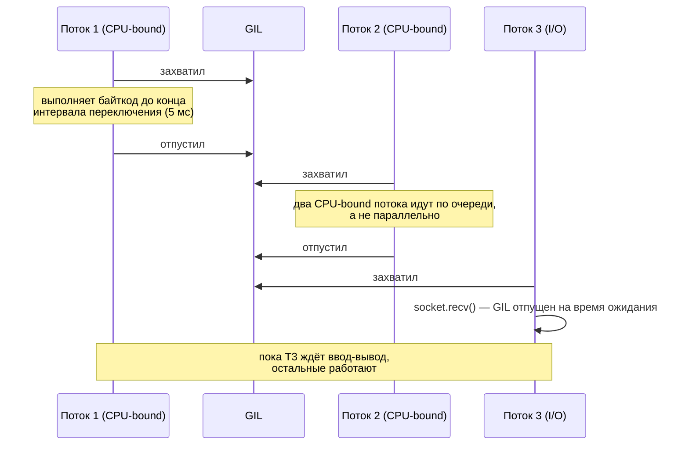
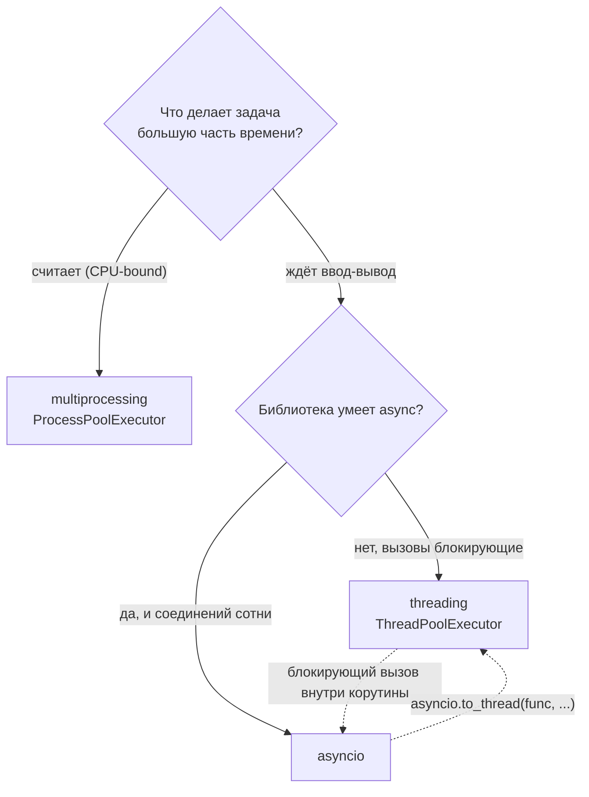

# GIL и конкурентность: threading / multiprocessing / asyncio

[← Группы исключений](exception-groups.md) · [🏠 Домой](../README.md) · [asyncio.TaskGroup →](asyncio-taskgroup.md)

---

## Что такое GIL и зачем он нужен?

**Коротко.** GIL (Global Interpreter Lock) — мьютекс в CPython, который
разрешает исполнять байткод только одному потоку одновременно. Он защищает
внутренние структуры интерпретатора, в первую очередь счётчики ссылок:
без него два потока могли бы одновременно менять refcount и повредить память
(см. [Управление памятью](memory-management.md)).



Следствие: потоки в CPython дают **конкурентность, но не параллелизм** для
Python-кода. GIL освобождается на время блокирующих операций — ввода-вывода,
`time.sleep`, вызовов C-библиотек, которые его явно отпускают (NumPy,
сжатие, хеширование).

**Подвох.** GIL — свойство **реализации**, а не языка. В Jython и IronPython
его нет никогда, а в CPython 3.13+ есть отдельная free-threading сборка
без GIL (PEP 703) — про неё отдельная тема
[CPython без GIL](free-threading-jit.md).

**Глубже.** Поток удерживает GIL до конца «интервала переключения» —
`sys.getswitchinterval()`, по умолчанию 5 мс — либо до блокирующего вызова.
Именно поэтому один CPU-bound поток может надолго задержать реакцию
остальных, а уменьшение интервала не помогает: растут накладные расходы
на переключения.

---

## Threading, multiprocessing или asyncio — как выбрать?

**Коротко.** По типу нагрузки. CPU-bound → процессы. I/O-bound с блокирующими
библиотеками → потоки. I/O-bound с сотнями и тысячами одновременных
операций → asyncio.



| Нагрузка | Инструмент | Почему |
|---|---|---|
| CPU-bound | `multiprocessing` / `ProcessPoolExecutor` | у каждого процесса свой интерпретатор и свой GIL |
| I/O-bound, блокирующие вызовы | `threading` / `ThreadPoolExecutor` | GIL отпускается на время ввода-вывода |
| I/O-bound, высокая конкурентность | `asyncio` | один поток, переключение только в `await`, задача дешевле потока |

Измерение на четырёх ядрах, счётный цикл на 60 млн итераций дважды:

```python
# послед.:    2.63 c
# 2 потока:   2.69 c   — потоки не помогли вообще
# 2 процесса: 1.38 c   — почти двукратное ускорение
```

**Подвох.** Классическая ошибка — брать потоки для CPU-bound задачи. Из-за GIL
ускорения не будет, а из-за переключений результат может выйти даже чуть хуже
однопоточного, как в замере выше.

**Глубже.** Плата за процессы: старт дорог (на Windows и macOS —
`spawn`, то есть новый интерпретатор и повторный импорт модуля), аргументы и
результаты передаются через `pickle`, общей памяти нет. Поэтому процессы
выгодны на крупных задачах и невыгодны на множестве мелких. Код, запускающий
процессы, обязан быть под `if __name__ == "__main__":` — иначе при `spawn`
дочерний процесс снова выполнит запуск и получится рекурсивное размножение.

---

## Что такое корутина и event loop?

**Коротко.** `async def` создаёт не результат, а объект-корутину — она ничего
не делает, пока её не запустит цикл событий. Event loop — однопоточный
планировщик: он ведёт очередь готовых задач и передаёт управление следующей,
когда текущая упирается в `await`.

```python
import asyncio

async def work(i):
    await asyncio.sleep(1)
    return i

async def main():
    results = await asyncio.gather(*(work(i) for i in range(100)))
    return len(results)

asyncio.run(main())
# 100 задач за 1.01 c — они ждали одновременно, а не по очереди
```

`asyncio.run()` создаёт цикл, выполняет корутину и закрывает цикл. Внутри
уже работающего цикла его вызывать нельзя.

**Подвох.** Забытый `await` — самая частая ошибка: `work(1)` без него просто
создаёт объект корутины, ничего не выполняя, и роняет `RuntimeWarning:
coroutine was never awaited`. Второй частый промах — блокирующий вызов внутри
корутины (`time.sleep`, `requests.get`, тяжёлый цикл): он останавливает
**весь** цикл событий вместе со всеми задачами. Такие вызовы уносят в поток
через `await asyncio.to_thread(func, ...)`.

**Глубже.** Асинхронность — это кооперативная многозадачность: переключение
происходит только в точках `await`, поэтому «состояние гонки между строчками»
здесь встречается реже, чем в потоках, но и вытеснить зависшую задачу
некому. Структурный запуск группы задач с корректной отменой — это
[`asyncio.TaskGroup`](asyncio-taskgroup.md), а несколько ошибок сразу
приезжают как [`ExceptionGroup`](exception-groups.md).

---

## Нужны ли блокировки, если есть GIL?

**Коротко.** Да. GIL гарантирует атомарность отдельного байткода, а не
операции целиком: `counter += 1` — это чтение, сложение и запись, и поток
может быть вытеснен между ними.

```python
from threading import Lock

lock = Lock()
with lock:              # Lock — контекстный менеджер
    counter += 1
```

Что даёт стандартная библиотека: `Lock` (простая блокировка), `RLock`
(повторный захват тем же потоком), `Semaphore` (ограничение
одновременных), `Event` (сигнал), `Condition`, `Barrier`. Для обмена
данными между потоками — `queue.Queue`, которая берёт синхронизацию на себя.

**Подвох.** Отдельные операции всё-таки атомарны — `list.append`,
`dict.__setitem__`, `deque.append`/`popleft` реализованы на C и не прерываются.
Отсюда идиома «очередь на `deque` без блокировок». Но комбинация из двух таких
операций (`if key not in d: d[key] = ...`) атомарной уже не является.

**Глубже.** `concurrent.futures` даёт единый интерфейс поверх обоих миров:
`ThreadPoolExecutor` и `ProcessPoolExecutor` различаются одной строкой, а код
с `executor.map(...)` / `submit()` + `Future` остаётся тем же. Это удобная
точка для эксперимента «что быстрее на моей нагрузке» — заменить класс
исполнителя и перезамерить.

---

[← Группы исключений](exception-groups.md) · [🏠 Домой](../README.md) · [asyncio.TaskGroup →](asyncio-taskgroup.md)
