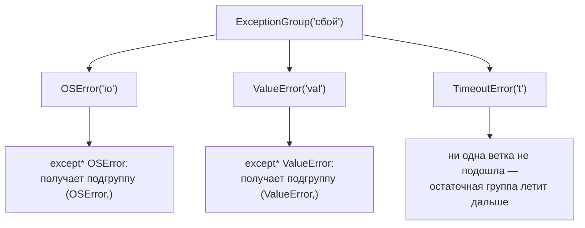

# Группы исключений: `except*` и `ExceptionGroup`

[← Исключения](exceptions.md) · [🏠 Домой](../README.md) · [GIL и конкурентность →](concurrency-gil.md)

---

## Зачем нужны группы исключений?

**Коротко.** `python 3.11+`. Чтобы поднять и обработать **несколько независимых
исключений одновременно** — обычный `raise` умеет только одно.

Проблема возникает в конкурентном коде: если параллельно упали три задачи из
десяти, до появления `ExceptionGroup` девять ошибок приходилось терять.

```python
# python 3.11+
try:
    raise ExceptionGroup("сбой", [OSError("io"), ValueError("val")])
except* OSError as eg:
    print("были OSError:", eg.exceptions)     # (OSError('io'),)
except* ValueError as eg:
    print("были ValueError:", eg.exceptions)  # (ValueError('val'),)
```

Ключевое отличие `except*` от `except`: срабатывают **все** подходящие ветки, а
не первая. Группа разбирается по типам, каждая ветка получает свою подгруппу.



**Подвох.** Если какое-то исключение не подошло ни под одну ветку `except*`, оно
не исчезает — улетает дальше остаточной группой:

```python
try:
    raise ExceptionGroup("g", [OSError("io"), ValueError("v")])
except* OSError as eg:
    ...
# ExceptionGroup: g (1 sub-exception) — ValueError продолжил распространяться
```

**Глубже.** Смешивать `except` и `except*` в одном `try` нельзя — это
`SyntaxError`. Разобрать группу вручную можно методом `split()`, который делит
её на совпавшую часть и остаток:

```python
eg = ExceptionGroup("g", [OSError("io"), ValueError("v")])
matched, rest = eg.split(OSError)
# matched.exceptions -> (OSError('io'),)
# rest.exceptions    -> (ValueError('v'),)
```

`ExceptionGroup` принимает только наследников `Exception`;
`BaseExceptionGroup` — более общий, он нужен, если внутрь может попасть
`KeyboardInterrupt` или `SystemExit`.

---

## Что такое `add_note()`?

**Коротко.** `python 3.11+` (PEP 678) — способ добавить к исключению
пояснение, не заворачивая его в новое.

```python
# python 3.11+
try:
    process(item)
except ValueError as e:
    e.add_note(f"при обработке записи {item.id}")
    raise
```

Заметки хранятся в `__notes__` и печатаются в трейсбеке под самим исключением.
Это часто спрашивают в связке с группами: у `ExceptionGroup` заметки помогают
понять, к какой именно задаче относится каждая ошибка.

---

Практическое применение групп — [`asyncio.TaskGroup`](asyncio-taskgroup.md),
который собирает в них ошибки упавших задач.

---

[← Исключения](exceptions.md) · [🏠 Домой](../README.md) · [GIL и конкурентность →](concurrency-gil.md)
