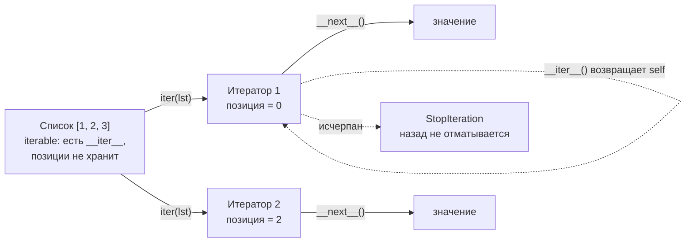

# Итератор

[← Управление памятью](memory-management.md) · [🏠 Домой](../README.md) · [Генератор →](generators.md)

---

## В чём разница между iterable и iterator?

**Коротко.** *Iterable* — то, по чему можно пройти: у него есть `__iter__`,
возвращающий итератор. *Iterator* — то, что помнит текущую позицию: у него есть
и `__next__`, и `__iter__`, возвращающий самого себя. Список — iterable, но не
iterator.

Разделение нужно, чтобы по одному списку можно было идти несколькими
независимыми проходами: каждый вызов `iter(lst)` создаёт новый итератор со своей
позицией, а сам список позицию не хранит.



```python
import collections.abc as abc

isinstance([1, 2], abc.Iterable)   # True
isinstance([1, 2], abc.Iterator)   # False  — список не помнит позицию

it = iter([1, 2])
isinstance(it, abc.Iterator)       # True
iter(it) is it                     # True  — итератор возвращает сам себя
```

**Подвох.** Объекта «только с `__next__`» не хватает — `for` по нему не пойдёт:

```python
class OnlyNext:
    def __next__(self): return 1

for _ in OnlyNext(): ...
# TypeError: 'OnlyNext' object is not iterable
```

Именно поэтому `__iter__`, возвращающий `self`, — обязательная часть протокола
итератора, а не формальность.

**Глубже.** Есть ещё старый протокол через `__getitem__`: если у объекта нет
`__iter__`, но есть `__getitem__`, принимающий целые индексы с нуля, `iter()`
сам построит по нему итератор и будет вызывать `__getitem__(0)`, `__getitem__(1)`
и т.д., пока не получит `IndexError`.

---

## Итератор вычисляет значения сразу или по требованию?

**Коротко.** По требованию. Итератор ленив по определению — очередное значение
считается только в момент вызова `__next__()`, ничего заранее не вычисляется и
не хранится.

Это принципиально: именно лень позволяет существовать бесконечным итераторам и
обрабатывать последовательности, которые не помещаются в память.

```python
import sys, itertools

sys.getsizeof(iter(range(10_000_000)))   # 32 — размер не зависит от длины

c = itertools.count()      # бесконечный итератор
next(c), next(c)           # (0, 1)  — «вычислить всё сразу» тут невозможно
```

**Подвох.** «Тогда чем итератор отличается от генератора по лени?» Ничем.
Генератор — это **частный случай** итератора, самый удобный способ его написать:

```python
gen = (i * i for i in range(5))
isinstance(gen, abc.Iterator)   # True
```

Противопоставлять их как «жадный» и «ленивый» неверно — ленивы оба.

**Глубже.** Цикл `for` под капотом один раз вызывает `iter()`, затем в цикле
`next()`, и ловит `StopIteration`, чтобы завершиться. Функция `next()`, вызванная
вручную, это исключение не ловит — поэтому ей передают второй аргумент как
значение по умолчанию: `next(it, None)`.

---

## Как пройти по итератору и что с ним происходит после?

Итератор одноразовый: после исчерпания он остаётся пустым, перематывать его
нельзя.

```python
it = iter([i * i for i in range(10)])
list(it)   # [0, 1, 4, 9, 16, 25, 36, 49, 64, 81]
list(it)   # []  — итератор исчерпан
```

Чего итератор не умеет, в отличие от последовательности:

- срезы — только через `itertools.islice()`, и он всё равно пройдёт элементы по
  порядку, а не прыгнет к нужному;
- `len()` — длина заранее неизвестна;
- обращение по индексу.

**Подвох.** Итератор не копирует исходный объект, а ссылается на него. Если
изменить исходный список во время обхода, итератор увидит изменения:

```python
l = [1, 2, 3, 4]
it = iter(l)
next(it)      # 1
l[1] = 999
next(it)      # 999  — а не 2, как можно было ожидать
```

**Глубже.** Изменение размера списка во время итерации по нему — источник
незаметных багов: удаление элементов сдвигает индексы, и часть элементов будет
пропущена. Правильно — итерироваться по копии (`for x in l[:]`) или собирать
новый список через comprehension.

---

## Как написать свой итератор?

Нужны оба метода протокола. Классический пример — обратный обход:

```python
class Countdown:
    def __init__(self, start):
        self.current = start

    def __iter__(self):
        return self                      # обязательно

    def __next__(self):
        if self.current <= 0:
            raise StopIteration          # сигнал «всё»
        self.current -= 1
        return self.current + 1

list(Countdown(3))   # [3, 2, 1]
```

На практике то же самое короче пишется [генератором](generators.md) — там
`__iter__` и `__next__` создаются автоматически.

---

[← Управление памятью](memory-management.md) · [🏠 Домой](../README.md) · [Генератор →](generators.md)
