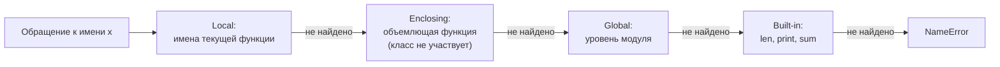

# Область видимости: LEGB, замыкания, late binding

[← bool](bool.md) · [🏠 Домой](../README.md) · [Функциональный стиль →](functional-programming.md)

---

## В каком порядке Python ищет имя?

**Коротко.** По правилу LEGB: Local → Enclosing → Global → Built-in. Поиск
идёт по цепочке до первого совпадения, и решается он в основном на этапе
компиляции, а не в момент выполнения.

- **Local** — имена текущей функции.
- **Enclosing** — имена объемлющей функции при вложенности (не класса!).
- **Global** — имена уровня модуля.
- **Built-in** — модуль `builtins`: `len`, `print`, `sum`.



```python
x = "global"

def outer():
    x = "enclosing"
    def inner():
        print(x)      # local нет -> берётся enclosing
    inner()

outer()
# enclosing
```

**Подвох.** Тело класса **не** попадает в цепочку LEGB для методов. Метод не
видит имена класса как «объемлющие» — он идёт сразу в global:

```python
x = 10

class C:
    x = 20
    def m(self):
        return x      # не 20, а глобальное 10

C().m()
# 10
```

Чтобы получить атрибут класса, его пишут явно: `self.x` или `C.x`.

---

## Почему присваивание внутри функции ломает чтение внешней переменной?

**Коротко.** Компилятор решает вид переменной по всему телу функции сразу:
если где-то в функции есть присваивание имени, имя считается локальным
на протяжении всей функции — включая строки *до* присваивания.

```python
counter = 0

def bump():
    print(counter)    # UnboundLocalError
    counter += 1

bump()
# UnboundLocalError: cannot access local variable 'counter'
# where it is not associated with a value
```

Лечится объявлением намерения:

- `global counter` — изменять переменную уровня модуля;
- `nonlocal counter` — изменять переменную объемлющей функции (не глобальную;
  если такой переменной нет, это ошибка ещё на этапе компиляции). Область
  видимости тела класса `nonlocal` тоже пропускает — та же особенность, что
  и у обычного поиска по LEGB (см. подвох выше).

```python
def make_counter():
    n = 0
    def inc():
        nonlocal n
        n += 1
        return n
    return inc

c = make_counter()
print(c(), c(), c())
# 1 2 3
```

**Подвох.** `global` и `nonlocal` нужны только для **присваивания**. Читать
внешнее имя и мутировать объект (`lst.append(1)`, `d["k"] = 1`) можно без них —
мутация не является присваиванием имени.

---

## Что такое замыкание и что именно оно хранит?

**Коротко.** Замыкание — функция плюс захваченные переменные объемлющей
области. Хранит она не значения, а **ячейки** (cell) — то есть ссылки на
переменные, которые продолжают жить после выхода из внешней функции.

```python
def outer():
    x = 1
    def inner():
        return x
    return inner

f = outer()
print(f.__code__.co_freevars)        # ('x',)
print(f.__closure__[0].cell_contents) # 1
```

`co_freevars` — имена, захваченные функцией; `__closure__` — кортеж ячеек с их
текущими значениями. Именно на этом механизме работают декораторы: обёртка
захватывает исходную функцию (см. [Декораторы](decorators.md)).

**Глубже.** Ячейка общая для всех замыканий, созданных в одном вызове внешней
функции. Два вложенных `inc`/`dec` с `nonlocal n` будут менять один и тот же
счётчик — это и есть «состояние без класса».

---

## Почему все функции из цикла возвращают одно и то же значение?

**Коротко.** Late binding: замыкание захватывает переменную, а не её значение.
К моменту вызова цикл давно закончился, и в ячейке лежит последнее значение.

```python
funcs = [lambda: i for i in range(3)]
print([f() for f in funcs])
# [2, 2, 2]  — а не [0, 1, 2]
```

Фиксируют значение в момент создания функции — через аргумент по умолчанию
(вычисляется один раз, при определении) или через `functools.partial`:

```python
funcs = [lambda i=i: i for i in range(3)]
print([f() for f in funcs])
# [0, 1, 2]
```

**Подвох.** Тот же дефолтный аргумент, который здесь спасает, в других местах
и есть источник классического бага — изменяемое значение по умолчанию
(`def f(acc=[])`) создаётся один раз и живёт между вызовами.

**Глубже.** У comprehension собственная область видимости (с Python 3), поэтому
переменная цикла не утекает наружу. Но замыкания, созданные внутри него, всё
равно ссылаются на одну ячейку, пока comprehension выполняется — область
видимости и время жизни ячейки это разные вещи.

---

[← bool](bool.md) · [🏠 Домой](../README.md) · [Функциональный стиль →](functional-programming.md)
