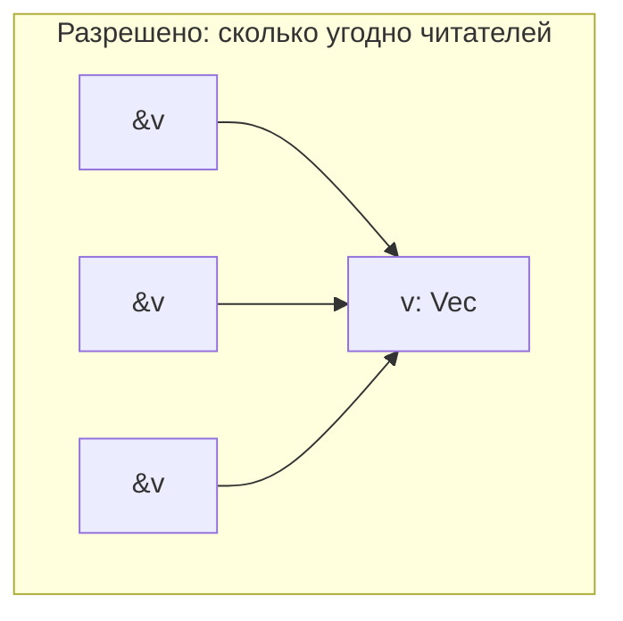
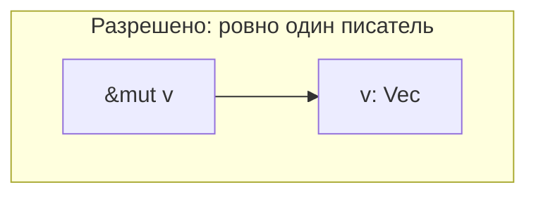
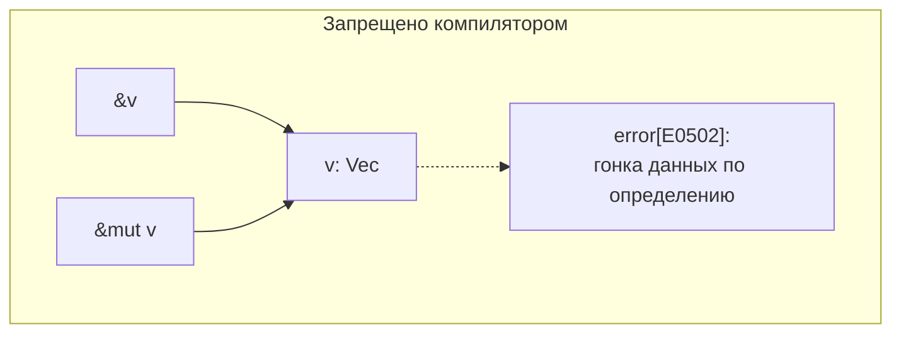
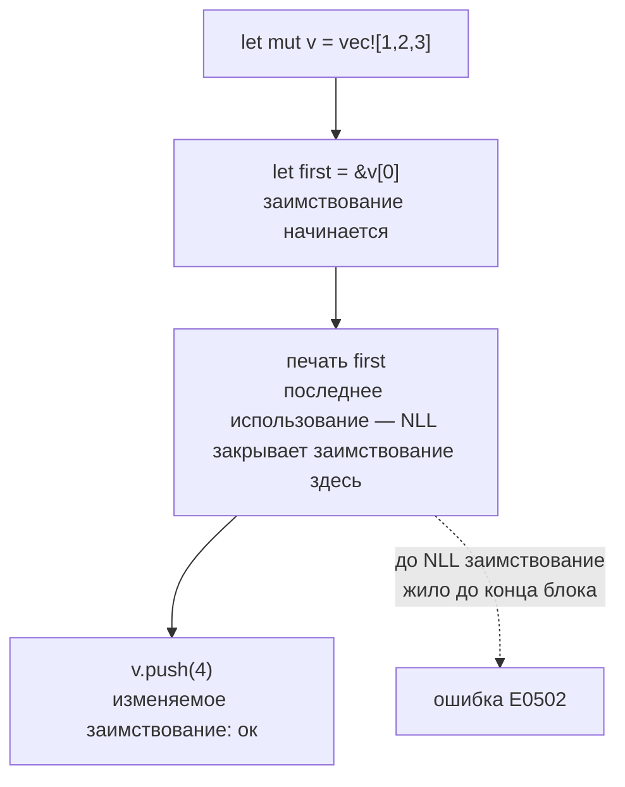

# Заимствование, ссылки и времена жизни

[← Владение, перемещение и Drop](ownership.md) · [🏠 Домой](../README.md) · [Типы и представление в памяти →](types-memory-layout.md)

---

## Сформулируйте правило заимствования

**Коротко.** В один момент времени на значение может существовать либо любое
число неизменяемых ссылок `&T`, либо ровно одна изменяемая `&mut T`, но не
то и другое одновременно. Короткая формула — «shared XOR mutable».







```rust
fn main() {
    let mut v = vec![1, 2, 3];

    let a = &v;
    let b = &v;             // сколько угодно читателей
    println!("{a:?} {b:?}"); // [1, 2, 3] [1, 2, 3]

    let m = &mut v;          // единственный писатель
    m.push(4);
    println!("{m:?}");       // [1, 2, 3, 4]
}
```

Смысл правила — не «уберечь от опечаток», а исключить гонку данных по
определению: гонка требует одновременного доступа, где хотя бы один —
запись. Если запись всегда эксклюзивна, гонок нет. Отсюда «fearless
concurrency»: то же правило, что защищает от ошибки в однопоточном коде,
защищает и в многопоточном.

**Подвох.** Ссылка не владеет значением и не может пережить владельца:

```rust
fn dangle() -> &String {      // ошибка: missing lifetime specifier
    let s = String::from("hi");
    &s                        // s умрёт в конце функции
}
```

В C это скомпилировалось бы и дало висячий указатель. В Rust — ошибка
компиляции, и правильный ответ: вернуть `String` (владение), а не ссылку.

---

## Что такое NLL и почему «раньше не компилировалось, а теперь да»?

**Коротко.** NLL (non-lexical lifetimes) — заимствование живёт до последнего
фактического использования ссылки, а не до конца лексического блока. Это
сильно расширило набор компилирующихся программ без изменения гарантий.

```rust
fn main() {
    let mut v = vec![1, 2, 3];

    let first = &v[0];
    println!("{first}");   // последнее использование first — здесь

    v.push(4);             // ок: заимствование уже закончилось
    println!("{v:?}");     // [1, 2, 3, 4]
}
```



До NLL (Rust 2015, ранние версии) `first` считалась живой до конца блока, и
`push` был бы ошибкой. Если поменять порядок — поставить `println!("{first}")`
после `push`, — ошибка вернётся, и это правильно: `push` может
переаллоцировать буфер и сделать `first` висячей.

**Глубже.** Проверку выполняет borrow checker на MIR (промежуточное
представление). Следующее поколение — Polonius, переписанный на анализ потока
данных; он принимает ещё несколько корректных, но сейчас отвергаемых
программ. Классический пример такого «ложного отказа» — функция, которая
возвращает `&mut` из ветки `if let` и хочет использовать `self` в `else`.

---

## Зачем нужны аннотации времён жизни и когда их можно опускать?

**Коротко.** Лайфтайм-аннотация не создаёт и не продлевает жизнь — она
связывает время жизни входных и выходных ссылок, чтобы компилятор мог
проверить, что результат не переживёт источник. В большинстве функций
аннотации выводятся автоматически по правилам elision.

```rust
// Нужна аннотация: два входа, компилятор не знает, откуда результат
fn longest<'a>(x: &'a str, y: &'a str) -> &'a str {
    if x.len() >= y.len() { x } else { y }
}

// Аннотация не нужна: вход один, его время жизни уходит на выход
fn first_word(s: &str) -> &str {
    s.split_whitespace().next().unwrap_or("")
}

fn main() {
    let a = String::from("длинная строка");
    let b = String::from("кор");
    println!("{}", longest(&a, &b));  // длинная строка
    println!("{}", first_word(&a));   // длинная
}
```

Правила elision, которые стоит уметь произнести:

1. каждый входной параметр-ссылка получает собственное время жизни;
2. если входное время жизни ровно одно — оно назначается всем выходным;
3. если среди параметров есть `&self` или `&mut self` — время жизни `self`
   назначается выходным.

Всё, что не покрывается этими тремя правилами, требует явных аннотаций.

**Подвох.** `'a` в `longest` не значит «оба аргумента живут одинаково». Это
значит: компилятор возьмёт **пересечение** — минимальное из времён жизни — и
проверит, что результат не используется дольше него.

---

## Что на самом деле означает `'static`?

**Коротко.** Для ссылки `&'static T` — «данные живут всю программу»
(строковые литералы, `Box::leak`, статические переменные). Для границы в
дженерике `T: 'static` — «тип не содержит заимствованных ссылок короче
программы», то есть либо владеющий тип, либо `&'static`.

```rust
fn needs_static<T: 'static>(_x: T) {}

fn main() {
    let s: &'static str = "литерал живёт всю программу";
    needs_static(String::from("owned")); // ок: String владеет данными, ссылок нет
    needs_static(s);                     // ок

    let local = String::from("local");
    // needs_static(&local);             // ошибка: &local живёт меньше 'static
    println!("{s} {local}");
}
```

Разница принципиальна: `String` удовлетворяет `T: 'static`, хотя живёт три
строки и освобождается. `'static` в границе — про **отсутствие внешних
заимствований**, а не про бессмертие.

**Подвох.** Именно эту границу требуют `std::thread::spawn` и
`tokio::spawn` — поток или задача могут пережить вызывающий кадр стека,
поэтому в них нельзя протащить ссылку на локальную переменную. Обходы:
клонировать, обернуть в `Arc` или взять `std::thread::scope`, который знает,
что все потоки завершатся до выхода из области видимости.

---

## Как хранить ссылку внутри структуры?

**Коротко.** Структура со ссылочным полем параметризуется временем жизни и не
может пережить данные, на которые ссылается.

```rust
struct Parser<'a> {
    input: &'a str,
    pos: usize,
}

impl<'a> Parser<'a> {
    fn new(input: &'a str) -> Self { Parser { input, pos: 0 } }

    fn rest(&self) -> &'a str { &self.input[self.pos..] }
}

fn main() {
    let text = String::from("ab cd");
    let p = Parser::new(&text);
    println!("{}", p.rest()); // ab cd
}
```

Практическая рекомендация: **сначала владеть, потом оптимизировать**. Поле
`String` не требует лайфтаймов и не заражает ими всю иерархию типов; менять на
`&'a str` стоит, когда профиль показал, что копирование действительно
мешает, — или использовать [`Cow<'a, str>`](strings.md), чтобы поддержать оба
случая.

**Глубже.** Самоссылающиеся структуры (поле-ссылка на другое поле того же
значения) в безопасном Rust построить нельзя: перемещение структуры сделало бы
ссылку висячей. Это же ограничение — причина существования `Pin` в
[асинхронном коде](async-await.md), где сгенерированный конечный автомат как
раз самоссылающийся.

---

## Как выглядят типичные схватки с borrow checker и как из них выходить?

**Коротко.** Почти все упираются в одно правило — «одна изменяемая или много
неизменяемых» — и решаются четырьмя приёмами: сузить область заимствования,
разбить доступ по полям, отложить изменение, сменить структуру данных.

**Две изменяемые ссылки на разные поля.** Компилятор умеет разбивать
заимствование по полям внутри одной функции, но не через вызов метода
`&mut self`:

```rust
struct Game { board: Vec<u8>, score: u32 }

impl Game {
    // не сработает: self заимствован целиком двумя вызовами
    // fn tick(&mut self) { self.update(&mut self.board); }

    fn tick(&mut self) {
        let Game { board, score } = self;  // разбили заимствование по полям
        for cell in board.iter_mut() { *cell += 1; }
        *score += 1;
    }
}
```

Для двух непересекающихся кусков одного среза есть `split_at_mut`.

**Изменение коллекции во время итерации.** Итератор держит заимствование,
поэтому `push` внутри `for` не пройдёт. Идиомы: `retain`, `drain`,
собрать индексы/новый вектор и применить изменения после цикла.

```rust
let mut v = vec![1, 2, 3, 4, 5];
v.retain(|x| x % 2 == 0);     // вместо «удалить в цикле»
println!("{v:?}");            // [2, 4]
```

**Граф со взаимными ссылками.** Дерево «родитель ↔ потомок» и
произвольный граф в лоб не выражаются. Идиоматичные решения: арена —
`Vec<Node>` и индексы вместо ссылок (быстро, просто, сериализуется) или
`Rc<RefCell<T>>` c `Weak` для обратных ссылок (см.
[умные указатели](smart-pointers.md)).

**Глубже.** `&mut T` не реализует `Copy` — иначе появились бы две изменяемые
ссылки. Но передавать её в функцию несколько раз подряд можно за счёт
**reborrow**: компилятор неявно подставляет `&mut *r`, создавая более
короткое вложенное заимствование, которое заканчивается вместе с вызовом.

**Глубже (вариантность).** `&'long T` можно передать туда, где ждут
`&'short T`: `&T` ковариантна по времени жизни. А `&mut T` и `Cell<T>`
инвариантны — иначе через них можно было бы записать короткоживущую ссылку
в долгоживущее место и получить висячий указатель.

---

[← Владение, перемещение и Drop](ownership.md) · [🏠 Домой](../README.md) · [Типы и представление в памяти →](types-memory-layout.md)
