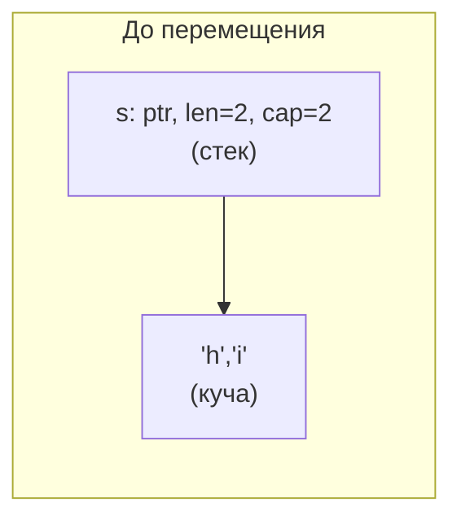
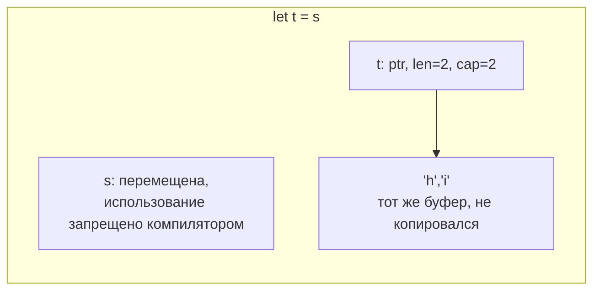
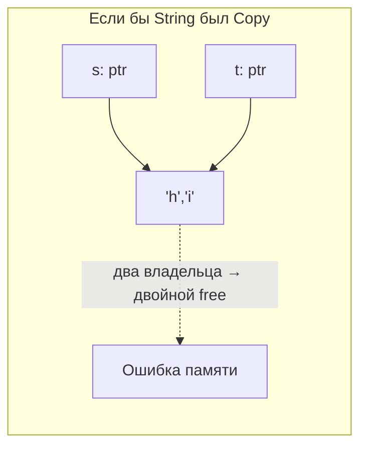

# Владение, перемещение и Drop

[← Базовый синтаксис](basics.md) · [🏠 Домой](../README.md) · [Заимствование, ссылки и времена жизни →](borrowing-lifetimes.md)

---

## Сформулируйте правила владения и объясните, что они дают

**Коротко.** Три правила: у каждого значения есть ровно один владелец;
владелец в каждый момент времени один; когда владелец выходит из области
видимости, значение уничтожается. Это статическая замена и сборщику мусора, и
ручному `free`.

Из этих правил бесплатно следует то, ради чего язык и создавался:

- **нет double free** — освобождает только владелец, и ровно один раз;
- **нет use-after-free** — ссылка не может пережить владельца (это проверяет
  [borrow checker](borrowing-lifetimes.md));
- **нет утечек по забывчивости** — освобождение вставляет компилятор;
- **нет гонок данных** — уникальный доступ к изменяемым данным гарантирован
  системой типов.

```rust
fn main() {
    {
        let s = String::from("hello"); // s — владелец буфера в куче
        println!("{s}");
    }                                  // здесь вызывается drop(s), память освобождена
    // println!("{s}");                // ошибка: cannot find value `s` in this scope
}
```

Важно: всё это происходит на этапе компиляции. В рантайме нет ни счётчиков,
ни таблиц, ни фонового потока — сгенерированный код такой же, как если бы вы
руками расставили `free` в правильных местах.

**Подвох.** «Rust гарантирует отсутствие утечек памяти» — неверно. Утечка не
считается нарушением безопасности: `std::mem::forget`, `Box::leak` и цикл из
`Rc` — безопасный код, который течёт. Гарантируется отсутствие *обращений к
освобождённой памяти*, а не отсутствие *неосвобождённой*.

---

## Что такое move-семантика и почему `Copy` — исключение, а не правило?

**Коротко.** Присваивание и передача в функцию по умолчанию **перемещают**
значение: владение уходит, исходная переменная становится статически
недоступной. Копируются молча только типы, реализующие маркерный трейт
`Copy` — скаляры, `&T`, кортежи и массивы из `Copy`-типов, — потому что их
побитовая копия безопасна.

```rust
fn takes(s: String) { println!("{s}"); }

fn main() {
    let s = String::from("hi");
    let t = s;        // move: владение ушло в t
    // println!("{s}"); // error[E0382]: borrow of moved value: `s`
    takes(t);          // move в функцию — t тоже больше не наш

    let a = 5;
    let b = a;         // i32: Copy — оба валидны
    println!("{a} {b}"); // 5 5
}
```

Почему `String` не `Copy`: он владеет буфером в куче. Побитовая копия дала бы
два владельца одного указателя и двойное освобождение — ровно то, что Rust
исключает.







**Подвох.** Move — это копия *метаданных*, а не данных. Перемещение `Vec` из
миллиона элементов копирует три машинных слова (указатель, длина, ёмкость), а
не миллион элементов. Поэтому «move дорого, лучше по ссылке» — обычно миф;
компилятор к тому же чаще всего устраняет и эту копию.

**Глубже.** Чем move в Rust отличается от move в C++: в C++ после
`std::move` переменная остаётся валидной в «moved-from» состоянии, для неё
всё равно вызовется деструктор, и читать её — легально, но обычно бессмысленно.
В Rust компилятор помечает переменную как перемещённую и запрещает любое
использование; деструктор для неё не вызывается (при условном перемещении
компилятор вставляет скрытый drop-флаг).

---

## Чем `Copy` отличается от `Clone` и почему тип с `Drop` не может быть `Copy`?

**Коротко.** `Copy` — неявная побитовая копия, маркерный трейт без методов.
`Clone` — явное `.clone()`, которое может быть сколь угодно дорогим (аллокация,
рекурсивный обход). `Copy` требует `Clone` как супертрейт, но не наоборот.

```rust
#[derive(Clone, Copy, Debug)]
struct Point { x: f64, y: f64 } // 16 байт, копировать безопасно

#[derive(Clone, Debug)]
struct User { name: String }    // Copy нельзя: внутри владеющий буфер

fn main() {
    let p = Point { x: 1.0, y: 2.0 };
    let q = p;                  // копия
    println!("{p:?} {q:?}");    // обе живы

    let u = User { name: "ann".into() };
    let v = u.clone();          // явная, видимая в коде цена
    println!("{u:?} {v:?}");
}
```

Тип с реализацией `Drop` не может быть `Copy`: копия означала бы два
экземпляра, для каждого вызвался бы деструктор, и ресурс освободился бы
дважды. Компилятор запрещает такую комбинацию напрямую.

**Подвох.** `.clone()` в Rust — не «зло», а инструмент. На собеседовании
выигрышная позиция: «в прототипе я клонирую и иду дальше, а если профиль
покажет, что это горячий путь, — переписываю на заимствование». Плохо не
клонировать, плохо клонировать не глядя в цикле на каждой итерации.

---

## Как работает `Drop` и в каком порядке уничтожаются значения?

**Коротко.** `Drop::drop` вызывается автоматически, когда значение выходит из
области видимости. Локальные переменные уничтожаются в порядке, обратном
объявлению; поля структуры — в порядке объявления. Это RAII: освобождение
любого ресурса (память, файл, сокет, блокировка) привязано к концу жизни
значения.

```rust
struct Noisy(&'static str);

impl Drop for Noisy {
    fn drop(&mut self) {
        println!("drop {}", self.0);
    }
}

fn main() {
    let _a = Noisy("a");
    let _b = Noisy("b");
    println!("конец main");
}
// конец main
// drop b
// drop a
```

Тот же механизм закрывает файл (`File`), снимает блокировку (`MutexGuard`),
завершает транзакцию. Явного `close()`/`unlock()` в идиоматичном Rust нет —
и забыть его невозможно.

**Подвох.** Вызвать `x.drop()` напрямую нельзя (ошибка «explicit destructor
calls not allowed»), иначе деструктор отработал бы дважды: один раз вручную,
второй — в конце области видимости. Освободить раньше времени можно функцией
`drop(x)`, которая просто забирает владение и роняет значение внутри себя —
её реализация буквально `fn drop<T>(_x: T) {}`.

**Глубже.** Паника внутри `drop` во время раскрутки стека из-за другой паники
приводит к немедленному `abort` процесса — «double panic». Поэтому в
деструкторах не паникуют и не делают ничего, что может паниковать. По этой же
причине асинхронного `Drop` в языке нет: деструктор не умеет ждать, и
корректное освобождение асинхронных ресурсов делают явными методами
(`shutdown().await`).

---

## Что такое частичное перемещение (partial move)?

**Коротко.** Из структуры можно вынести отдельное поле — тогда это поле
перемещено, а сама структура целиком становится недоступной; остальные поля
использовать можно.

```rust
struct User { name: String, age: u32 }

fn main() {
    let u = User { name: "ann".into(), age: 30 };
    let name = u.name;        // частичное перемещение
    // println!("{}", u.name); // ошибка: value moved
    // let v = u;              // ошибка: use of partially moved value
    println!("{name} {}", u.age); // ann 30 — age на месте, он Copy
}
```

Из типов, реализующих `Drop`, частично перемещать нельзя: деструктору
пришлось бы работать с полусобранным значением. Идиоматичные обходы —
`std::mem::take` (забрать значение, оставив `Default`), `std::mem::replace`
или метод `into_parts(self) -> (A, B)`, разбирающий структуру целиком.

**Глубже.** `match`/`let` c деструктуризацией по значению — это тоже
перемещение: `let User { name, age } = u;` разбирает структуру и перемещает
`name`. Чтобы только посмотреть, деструктурируют по ссылке
(`let User { name, .. } = &u;`) или используют `ref`-паттерны.

---

## Почему в Rust отказались от сборщика мусора?

**Коротко.** Ради предсказуемости: детерминированное освобождение даёт
отсутствие пауз и позволяет одним и тем же механизмом владеть не только
памятью, но и файловыми дескрипторами, сокетами, блокировками.

GC умеет управлять только памятью. Файл, закрытый «когда-нибудь потом»,
удерживает дескриптор ОС; блокировка, снятая финализатором, — вообще
источник дедлоков. Отсюда в языках с GC отдельные механизмы — `defer`,
`try-with-resources`, `with`, `using`. В Rust это один механизм: владение +
`Drop`.

**Подвох.** «Значит, в Rust нельзя посчитать ссылки» — можно: `Rc`/`Arc` дают
разделяемое владение через подсчёт ссылок, просто он опциональный, локальный и
видимый в типе. Это не GC: циклы `Rc` не собираются и текут, для их разрыва
есть `Weak` (см. [умные указатели](smart-pointers.md)).

---

[← Базовый синтаксис](basics.md) · [🏠 Домой](../README.md) · [Заимствование, ссылки и времена жизни →](borrowing-lifetimes.md)
