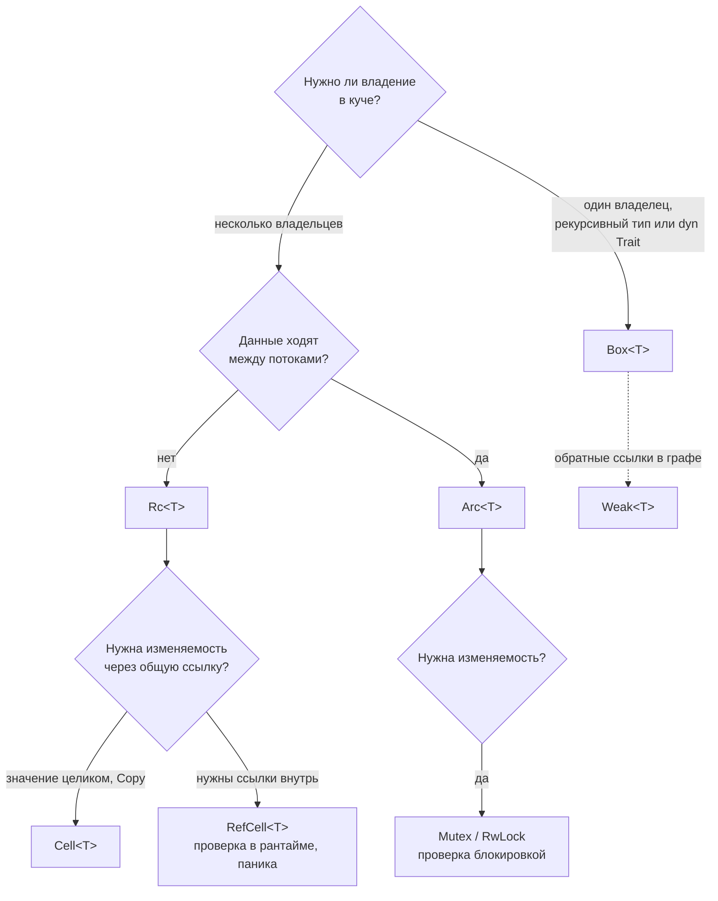
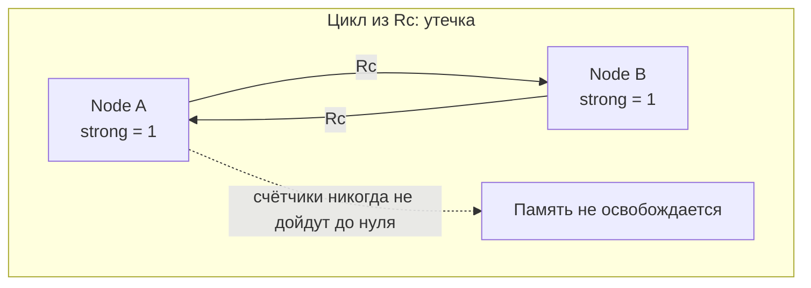
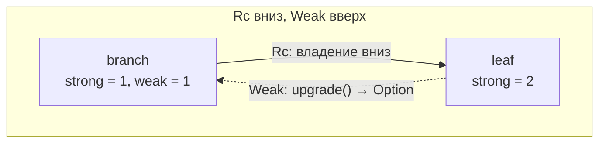

# Умные указатели и внутренняя изменяемость

[← Замыкания и итераторы](closures-iterators.md) · [🏠 Домой](../README.md) · [Стандартные трейты и преобразования →](std-traits.md)

---

## Зачем нужен `Box<T>`?

**Коротко.** `Box` — единственный владелец значения в куче. Три канонических
применения: рекурсивные типы, большие значения, которые дорого перемещать по
стеку, и трейт-объекты `Box<dyn Trait>`. Накладных расходов сверх одной
аллокации нет.

```rust
#[derive(Debug)]
enum Expr {
    Num(i64),
    Add(Box<Expr>, Box<Expr>),   // без Box размер типа был бы бесконечным
}

fn eval(e: &Expr) -> i64 {
    match e {
        Expr::Num(n) => *n,
        Expr::Add(a, b) => eval(a) + eval(b),
    }
}

fn main() {
    let e = Expr::Add(Box::new(Expr::Num(2)), Box::new(Expr::Num(40)));
    println!("{}", eval(&e));    // 42
}
```

Почему без `Box` не работает: чтобы посчитать размер `Expr`, компилятору нужен
размер `Expr` — рекурсия без основания. `Box` разрывает её: указатель всегда
одно слово.

**Подвох.** `Box<dyn Trait>` — не то же самое, что `Box<T>`: это широкий
указатель (данные + vtable), 16 байт вместо 8 (см.
[типы](types-memory-layout.md)).

---

## Чем `Rc` отличается от `Arc` и почему `Rc` не `Send`?

**Коротко.** Оба дают разделяемое владение через подсчёт ссылок. У `Rc`
счётчик обычный, у `Arc` — атомарный. Поэтому `Rc` дешевле, но не может
пересекать границу потока: неатомарный инкремент из двух потоков — гонка,
которая приводит к преждевременному освобождению.

```rust
use std::rc::Rc;
use std::sync::Arc;

fn main() {
    let a = Rc::new(vec![1, 2, 3]);
    let b = Rc::clone(&a);            // клонируется указатель, не данные
    println!("{} {}", Rc::strong_count(&a), b.len()); // 2 3

    let shared = Arc::new(String::from("общие данные"));
    let handles: Vec<_> = (0..3).map(|i| {
        let s = Arc::clone(&shared);
        std::thread::spawn(move || format!("поток {i}: {}", s.len()))
    }).collect();
    for h in handles { println!("{}", h.join().unwrap()); }
}
```

Правило выбора простое: однопоточный код — `Rc`, многопоточный — `Arc`.
Брать `Arc` «на всякий случай» не стоит: атомарные операции дороже обычных,
особенно при конкуренции за кеш-линию.

**Подвох.** `Rc::clone(&a)` предпочтительнее `a.clone()` не по семантике (они
идентичны), а по читаемости: сразу видно, что копируется счётчик, а не
данные. Это соглашение из официальной книги.

---

## Почему `Rc<T>` даёт только неизменяемый доступ и что с этим делают?

**Коротко.** Если бы `Rc` давал `&mut`, существовало бы несколько изменяемых
ссылок на одни данные — прямое нарушение правила заимствования. Поэтому
изменяемость добавляют вложенным типом: `Rc<RefCell<T>>` однопоточно,
`Arc<Mutex<T>>` многопоточно.

```rust
use std::cell::RefCell;
use std::rc::Rc;

fn main() {
    let shared = Rc::new(RefCell::new(vec![1, 2]));
    let other = Rc::clone(&shared);

    other.borrow_mut().push(3);            // изменение через второй владелец
    println!("{:?}", shared.borrow());     // [1, 2, 3]
}
```

Эти две комбинации — `Rc<RefCell<T>>` и `Arc<Mutex<T>>` — самые узнаваемые
сочетания в языке; их стоит уметь произнести не задумываясь.

---

## Что такое внутренняя изменяемость и чем `Cell` отличается от `RefCell`?

**Коротко.** Внутренняя изменяемость — изменение данных через `&T` там, где
компилятор не может проверить эксклюзивность статически. `Cell` работает
только целыми значениями (положить/забрать, без ссылок) и ничего не стоит;
`RefCell` выдаёт ссылки и проверяет правило заимствования **в рантайме**,
паникуя при нарушении.

Как выбирать между всеми умными указателями сразу:



```rust
use std::cell::{Cell, RefCell};

fn main() {
    let counter = Cell::new(0);
    counter.set(counter.get() + 1);     // без &mut и без накладных расходов
    println!("{}", counter.get());       // 1

    let data = RefCell::new(vec![1, 2]);
    {
        let mut m = data.borrow_mut();
        m.push(3);
    }                                    // заимствование закончилось здесь
    println!("{:?}", data.borrow());     // [1, 2, 3]

    let _a = data.borrow_mut();
    // let _b = data.borrow_mut();       // паника: already borrowed: BorrowMutError
}
```

Ключевая мысль для собеседования: `RefCell` не отменяет правило «одна
изменяемая или много неизменяемых» — он **переносит его проверку из
компиляции в рантайм**, меняя ошибку компиляции на панику. Это осознанный
размен, а не лазейка.

**Подвох.** Двойной `borrow_mut()` в разных функциях одного колбэка — самая
частая паника в коде на `Rc<RefCell<T>>`. Лечится сужением области жизни
guard'а (как в примере выше — блоком) или пересмотром структуры данных.

**Глубже.** Все эти типы построены на `UnsafeCell<T>` — единственном легальном
способе получить `&mut` из `&`. Компилятор знает про `UnsafeCell` и отключает
для него оптимизации, основанные на предположении о неизменности.

---

## Как разорвать цикл `Rc` и зачем нужен `Weak`?

**Коротко.** Взаимные `Rc`-ссылки — утечка: счётчики никогда не дойдут до
нуля. `Weak<T>` не увеличивает счётчик сильных ссылок; чтобы им
воспользоваться, вызывают `upgrade()`, который возвращает `Option<Rc<T>>` —
`None`, если значение уже освобождено.

```rust
use std::cell::RefCell;
use std::rc::{Rc, Weak};

struct Node {
    value: i32,
    parent: RefCell<Weak<Node>>,      // наверх — слабая
    children: RefCell<Vec<Rc<Node>>>, // вниз — сильная
}

fn main() {
    let leaf = Rc::new(Node {
        value: 3,
        parent: RefCell::new(Weak::new()),
        children: RefCell::new(vec![]),
    });
    let branch = Rc::new(Node {
        value: 5,
        parent: RefCell::new(Weak::new()),
        children: RefCell::new(vec![Rc::clone(&leaf)]),
    });
    *leaf.parent.borrow_mut() = Rc::downgrade(&branch);

    println!("{:?}", leaf.parent.borrow().upgrade().map(|p| p.value)); // Some(5)
    println!("{} {}", Rc::strong_count(&branch), Rc::weak_count(&branch)); // 1 1
}
```





Правило: **владение вниз по иерархии — `Rc`, обратные ссылки — `Weak`**.

**Подвох.** Утечка из-за цикла `Rc` — безопасный код: язык не обещает
отсутствия утечек, только отсутствие обращений к освобождённой памяти (см.
[владение](ownership.md)).

---

## Как в Rust сделать двусвязный список или граф?

**Коротко.** Три варианта, и правильный ответ — назвать все три с оценкой:
арена с индексами (проще и быстрее всего), `Rc<RefCell<T>>` + `Weak`
(гибко, но с рантайм-проверками и риском паники), `unsafe` с сырыми
указателями (быстро и сложно, нужен Miri).

```rust
// Арена: узлы в Vec, «ссылки» — индексы
struct Graph {
    nodes: Vec<String>,
    edges: Vec<(usize, usize)>,
}

impl Graph {
    fn neighbors(&self, i: usize) -> Vec<&str> {
        self.edges.iter()
            .filter(|(a, _)| *a == i)
            .map(|(_, b)| self.nodes[*b].as_str())
            .collect()
    }
}

fn main() {
    let g = Graph {
        nodes: vec!["a".into(), "b".into(), "c".into()],
        edges: vec![(0, 1), (0, 2)],
    };
    println!("{:?}", g.neighbors(0)); // ["b", "c"]
}
```

Почему арена обычно выигрывает: одна аллокация вместо тысяч, отличная
локальность кеша, тривиальная сериализация, нет `RefCell`-паник. Цена —
индексы не проверяются на валидность (решается generational-индексами из
крейтов вроде `slotmap`).

**Подвох.** Вопрос «напишите двусвязный список» на собеседовании по Rust —
проверка на понимание, а не на кодирование. Хороший ответ: «в безопасном
Rust это учебный пример сложности, потому что модель владения не выражает
взаимные ссылки; на практике я возьму `VecDeque` или арену, а если нужен
именно список — `std::collections::LinkedList` или крейт с проверенным
`unsafe`».

---

## Как сделать ленивую или однократную инициализацию?

**Коротко.** `OnceCell` (однопоточно), `OnceLock` (потокобезопасно),
`LazyLock` (ленивая статическая переменная, стабильна с 1.80 — закрывает
нишу старых `lazy_static` и `once_cell`).

```rust
use std::sync::LazyLock;
use std::collections::HashMap;

static CONFIG: LazyLock<HashMap<&str, &str>> = LazyLock::new(|| {
    println!("инициализация выполняется один раз");
    HashMap::from([("host", "localhost"), ("port", "8080")])
});

fn main() {
    println!("{}", CONFIG["host"]);  // инициализация выполняется один раз \n localhost
    println!("{}", CONFIG["port"]);  // 8080 — повторной инициализации нет
}
```

Это идиоматичная замена изменяемым глобальным переменным: `static mut`
требует `unsafe` и в новом коде не используется.

---

## Что делают `Deref` и deref coercion?

**Коротко.** `Deref` позволяет типу вести себя как ссылка на другой тип:
компилятор автоматически вставляет `*`, приводя `&String → &str`,
`&Vec<T> → &[T]`, `&Box<T> → &T`. Поэтому у `String` работают методы `str`, а
у `Vec` — методы срезов.

```rust
fn shout(s: &str) -> String { s.to_uppercase() }

fn main() {
    let owned = String::from("привет");
    println!("{}", shout(&owned));   // ПРИВЕТ — &String приведён к &str
    println!("{}", owned.len());     // 12 — len() определён у str

    let boxed = Box::new(vec![1, 2, 3]);
    println!("{}", boxed.len());     // 3 — два уровня разыменования подряд
}
```

**Подвох.** `Deref` предназначен только для умных указателей. Использовать его,
чтобы «унаследовать» методы внутреннего типа в newtype-обёртке, — известный
антипаттерн: получается неявное, плохо предсказуемое API, где неясно, чьи
методы вызываются. Для этого есть явные `as_ref()`, `into_inner()` или
проброс нужных методов вручную.

---

[← Замыкания и итераторы](closures-iterators.md) · [🏠 Домой](../README.md) · [Стандартные трейты и преобразования →](std-traits.md)
