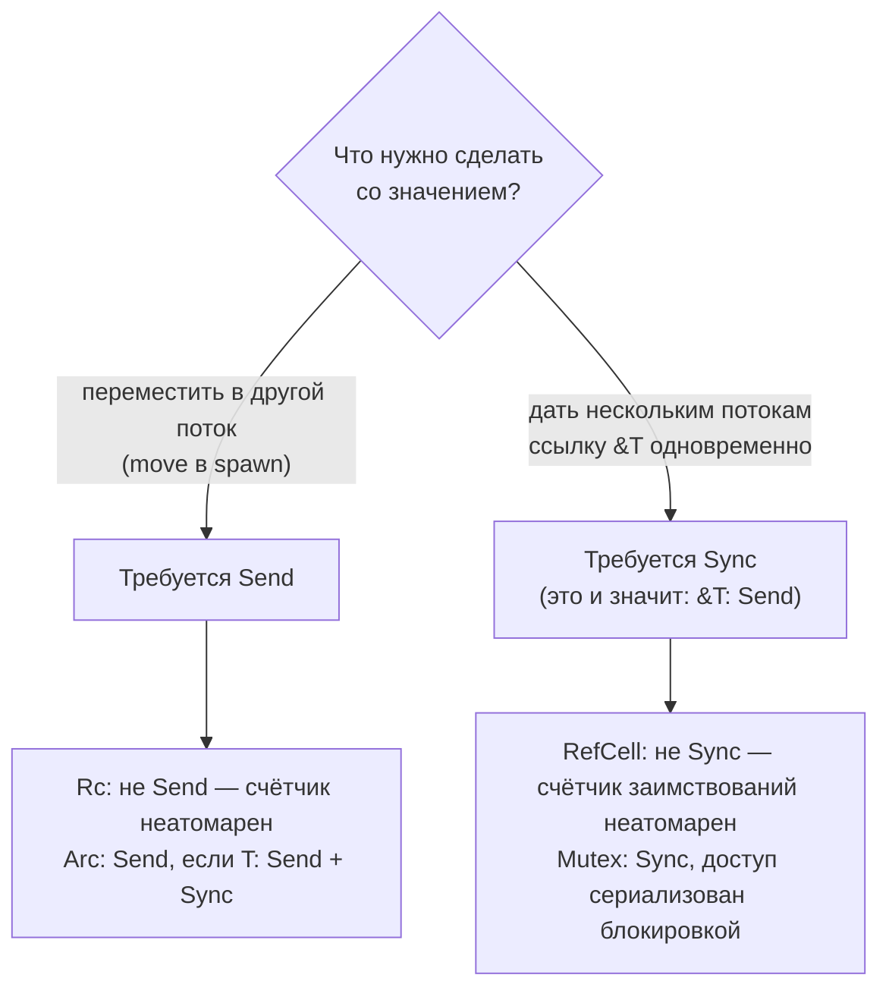

# Потоки, Send и Sync

[← unsafe, UB и FFI](unsafe-ffi.md) · [🏠 Домой](../README.md) · [Примитивы синхронизации и модель памяти →](sync-primitives.md)

---

## Как в Rust запускают потоки?

**Коротко.** `std::thread::spawn` создаёт **настоящий поток ОС** и возвращает
`JoinHandle<T>`; `join()` дожидается завершения и отдаёт результат или
`Err`, если поток запаниковал. Никакого рантайма и своего планировщика, в
отличие от горутин Go.

```rust
use std::thread;

fn main() {
    let handles: Vec<_> = (0..3)
        .map(|i| thread::spawn(move || {
            let sum: u64 = (0..1000).map(|x| x * i).sum();
            format!("поток {i}: {sum}")
        }))
        .collect();

    for h in handles {
        println!("{}", h.join().unwrap());
    }
    // поток 0: 0
    // поток 1: 499500
    // поток 2: 999000

    let bad = thread::spawn(|| panic!("упс"));
    println!("{}", bad.join().is_err());   // true — паника не уронила main
}
```

Цена потока — стек около 2 МБ (настраивается через `thread::Builder`
`stack_size`) и переключение контекста ядром. Десятки тысяч соединений
потоками не обслуживают — для этого есть [async](async-await.md).

**Подвох.** Паника в потоке роняет только этот поток; `join()` вернёт
`Err` с полезной нагрузкой паники. Если главный поток завершится, не
дождавшись остальных, процесс закончится вместе со всеми — потоки не
«держат» программу живой.

---

## В чём разница между `Send` и `Sync`?

**Коротко.** `Send` — значение можно **переместить** в другой поток. `Sync` —
на значение можно безопасно ссылаться из нескольких потоков одновременно;
формально `T: Sync` тогда и только тогда, когда `&T: Send`.

Оба — автоматические маркерные трейты: компилятор выводит их из полей;
вручную реализуются только через `unsafe`.



| Тип | `Send` | `Sync` | Почему |
|---|---|---|---|
| `i32`, `String`, `Vec<T>` | да | да | нет разделяемого изменяемого состояния |
| `Rc<T>` | нет | нет | неатомарный счётчик ссылок |
| `Arc<T>` (при `T: Send + Sync`) | да | да | атомарный счётчик |
| `RefCell<T>` | да | нет | счётчик заимствований неатомарен |
| `Mutex<T>` (при `T: Send`) | да | да | доступ сериализован блокировкой |
| `MutexGuard<T>` | нет | да (при `T: Sync`) | блокировку освобождает захвативший поток |
| `*const T`, `*mut T` | нет | нет | о гарантиях ничего не известно |

```rust
use std::rc::Rc;
use std::sync::Arc;
use std::thread;

fn main() {
    let shared = Arc::new(vec![1, 2, 3]);
    let s = Arc::clone(&shared);
    let h = thread::spawn(move || s.iter().sum::<i32>());
    println!("{}", h.join().unwrap());   // 6

    let local = Rc::new(vec![1, 2, 3]);
    // thread::spawn(move || local.len());
    // ошибка: `Rc<Vec<i32>>` cannot be sent between threads safely
    println!("{}", local.len());          // 3
}
```

**Подвох.** Классический вопрос — назвать тип, у которого есть одно и нет
другого. Пример «`Send`, но не `Sync`» — `RefCell<T>`: переместить в другой
поток можно (тогда он там один), а вот делить ссылку между потоками нельзя,
потому что счётчик заимствований не атомарен. Пример «`Sync`, но не `Send`» —
`MutexGuard`: ссылку на него делить безопасно, а вот освободить блокировку
обязан тот же поток, который её взял (требование pthread).

---

## Почему это называют «fearless concurrency»?

**Коротко.** Потому что **гонки данных** запрещены системой типов:
`thread::spawn` требует `F: Send + 'static`, и передать в поток `Rc` или
`&mut` на локальную переменную просто не получится. Компилятор ловит то, что в
C++ ловится только TSan и то не всегда.

```rust
use std::thread;

fn main() {
    let mut counter = 0;
    // thread::spawn(move || counter += 1);   // move скопирует counter, а не поделит его
    // thread::spawn(|| counter += 1);        // ошибка: closure may outlive `counter`
    counter += 1;
    println!("{counter}");                     // 1
}
```

**Подвох (важный).** Rust исключает **гонки данных** (одновременный доступ с
записью без синхронизации), но не **состояния гонки** в широком смысле:
неверный порядок событий, потерянное обновление на уровне логики, TOCTOU,
дедлоки. Это уточнение на собеседовании ждут почти всегда — уметь развести
два понятия важнее, чем знать сигнатуру `spawn`.

---

## Что означает `'static` в `spawn` и как заимствовать локальные данные?

**Коротко.** `'static` требует, чтобы замыкание не держало заимствований
короче программы — поток может пережить кадр стека, который его создал.
Обходы: `move` + владение, `Arc` для разделения либо `thread::scope`.

```rust
use std::thread;

fn main() {
    let data = vec![1, 2, 3, 4, 5, 6];

    // scope гарантирует, что все потоки завершатся до выхода из блока,
    // поэтому заимствовать локальные переменные можно
    thread::scope(|s| {
        let (left, right) = data.split_at(3);
        let h1 = s.spawn(|| left.iter().sum::<i32>());
        let h2 = s.spawn(|| right.iter().sum::<i32>());
        println!("{} {}", h1.join().unwrap(), h2.join().unwrap()); // 6 15
    });

    println!("{data:?}");   // [1, 2, 3, 4, 5, 6] — data цела, ничего не клонировали
}
```

`thread::scope` (стабилен с 1.63) закрывает целый класс задач «разбить массив
и посчитать параллельно» без `Arc` и без клонирования.

---

## Как потоки обмениваются данными?

**Коротко.** Два подхода: каналы (`std::sync::mpsc`) и разделяемое состояние
(`Arc<Mutex<T>>`). Rust, в отличие от Go, не навязывает ни один из них.

```rust
use std::sync::mpsc;
use std::thread;

fn main() {
    let (tx, rx) = mpsc::channel();

    for i in 0..3 {
        let tx = tx.clone();          // много отправителей
        thread::spawn(move || tx.send(i * 10).unwrap());
    }
    drop(tx);                          // закрываем последний отправитель

    let mut got: Vec<i32> = rx.iter().collect();  // итерация до закрытия канала
    got.sort();
    println!("{got:?}");               // [0, 10, 20]
}
```

`mpsc` — «много отправителей, один получатель»: `Receiver` не клонируется.
`recv()` блокирует до появления значения и возвращает `Err`, когда все
отправители сброшены. Если нужны несколько получателей, `select` или
ограниченные очереди с другим поведением — берут `crossbeam-channel`.

**Подвох.** Забытый `drop(tx)` — классическое зависание: пока жив хотя бы один
`Sender` (например, оригинальный `tx` в `main`), канал не закроется, и цикл
по `rx` не завершится никогда.

---

## Как быстро распараллелить обработку коллекции?

**Коротко.** `rayon`: замена `iter()` на `par_iter()` — и работа
раскладывается по пулу потоков с work stealing.

```rust
// Cargo.toml: rayon = "1"
use rayon::prelude::*;

fn is_prime(n: u64) -> bool {
    n > 1 && (2..).take_while(|d| d * d <= n).all(|d| n % d != 0)
}

fn main() {
    let count = (2..200_000u64).into_par_iter().filter(|&n| is_prime(n)).count();
    println!("{count}");    // 17984
}
```

Почему это безопасно: `rayon` требует от замыкания `Send + Sync`, а
компилятор проверяет, что вы не тащите в него `Rc` или незащищённое
изменяемое состояние. Гонку данных при таком распараллеливании написать
просто не получится.

**Подвох.** `par_iter` не ускоряет ввод-вывод и на мелких коллекциях
проигрывает из-за накладных расходов на разбиение. Правильный ответ: измерять
`criterion`-бенчмарком, а не включать «параллельность» повсеместно.

---

## Когда потоки, а когда async?

**Коротко.** Потоки — для CPU-нагрузки и небольшого числа параллельных задач.
Async — для десятков тысяч одновременных ожиданий ввода-вывода.

| | Потоки | Async |
|---|---|---|
| Стоимость единицы | ~2 МБ стека, планировщик ядра | сотни байт, планировщик в userspace |
| Хорош для | вычислений, `rayon` | сети, тысяч соединений |
| Переключение | системный вызов | вызов функции |
| Сложность | простой код | заражение `async`, `Pin`, cancel safety |

Смешивать нормально и правильно: `tokio` обслуживает сеть, а тяжёлые
вычисления уезжают в `spawn_blocking` или в пул `rayon` — см.
[async](async-await.md).

---

[← unsafe, UB и FFI](unsafe-ffi.md) · [🏠 Домой](../README.md) · [Примитивы синхронизации и модель памяти →](sync-primitives.md)
