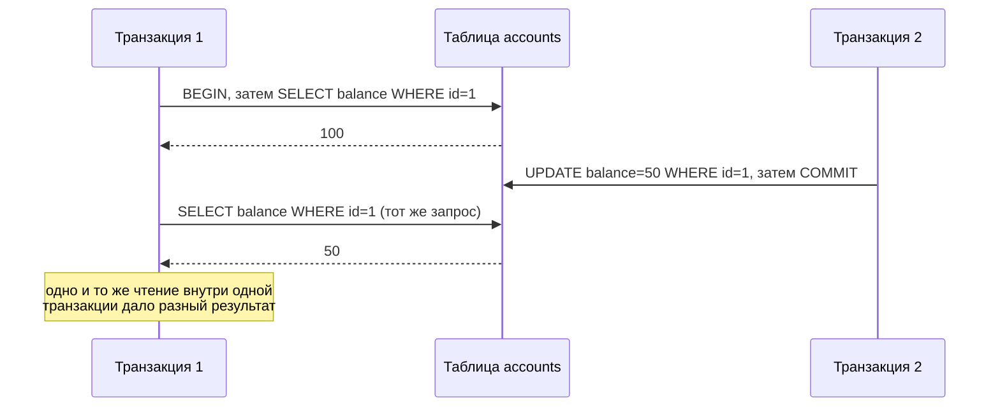
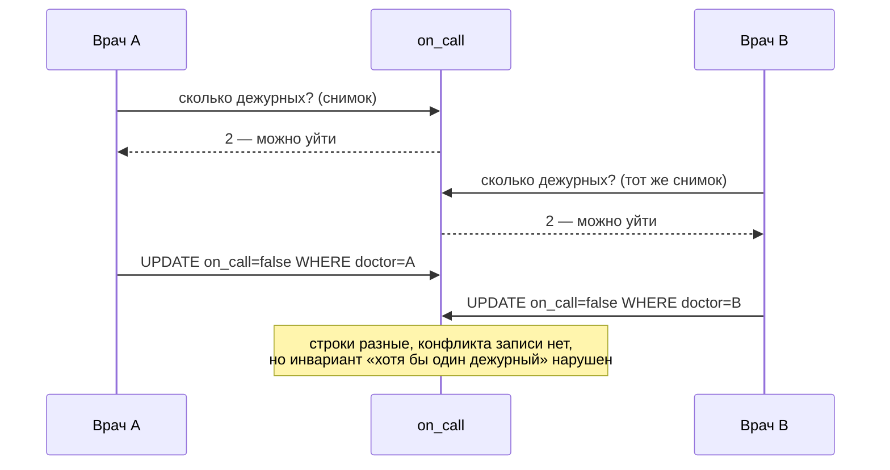

# ACID, изоляция транзакций и NULL

[← Нормализация](normalization.md) · [🏠 Домой](../README.md) · [Блокировки и дедлоки →](locking.md)

---

## Что такое ACID?

**Коротко.** Четыре свойства, которые СУБД гарантирует для транзакции:
атомарность, согласованность, изолированность, долговечность.

- **Atomicity (атомарность)** — транзакция выполняется целиком или не
  выполняется вовсе. Упала на середине — состояние БД остаётся прежним.
- **Consistency (согласованность)** — транзакция переводит БД из одного
  корректного состояния в другое: ограничения, внешние ключи и `CHECK` не
  нарушаются.
- **Isolation (изолированность)** — параллельные транзакции не видят
  промежуточных состояний друг друга. Насколько строго — определяет уровень
  изоляции, см. следующий вопрос.
- **Durability (долговечность)** — после `COMMIT` изменения переживут отключение
  питания и падение процесса.

**Глубже.** Долговечность обеспечивается журналом упреждающей записи
(WAL, write-ahead log): изменение сначала пишется в журнал и сбрасывается на
диск, и только потом применяется к данным. После сбоя СУБД проигрывает журнал и
восстанавливает состояние.

---

## Какие бывают уровни изоляции и какие аномалии они допускают?

**Коротко.** Четыре уровня по стандарту SQL. Чем строже, тем меньше аномалий и
тем дороже параллелизм.

| Уровень | Грязное чтение | Неповторяющееся чтение | Фантомы |
|---|---|---|---|
| READ UNCOMMITTED | возможно | возможно | возможны |
| READ COMMITTED | нет | возможно | возможны |
| REPEATABLE READ | нет | нет | возможны*/** |
| SERIALIZABLE | нет | нет | нет |

Аномалии:

- **Грязное чтение (dirty read)** — транзакция видит незакоммиченные изменения
  другой, которая потом может откатиться.
- **Неповторяющееся чтение (non-repeatable read)** — одна и та же строка,
  прочитанная дважды, даёт разные значения: между чтениями её обновили и
  закоммитили.
- **Фантомное чтение (phantom read)** — повторный запрос по тому же условию
  возвращает **новые строки**, которых в первый раз не было.

Неповторяющееся чтение по шагам:



Write skew, который снимочная изоляция не ловит:



**Подвох.** Стандарт описывает минимальные гарантии, а СУБД их превышают, и
названия уровней вводят в заблуждение:

- **PostgreSQL** по умолчанию `READ COMMITTED`. Уровня `READ UNCOMMITTED` в нём
  фактически нет — запрос его принимает, но ведёт себя как `READ COMMITTED`.
  А `REPEATABLE READ` в Postgres благодаря снимкам данных не допускает и
  фантомов (отсюда звёздочка в таблице).
- **MySQL/InnoDB** по умолчанию `REPEATABLE READ` — то есть строже, чем Postgres.
  И тоже почти всегда закрывает фантомы (вторая звёздочка): InnoDB использует
  next-key locking — блокировки не только на существующие строки, но и на
  «промежутки» (gap locks) между ними, что не даёт вставить строку, которая
  попала бы под условие уже выполненного запроса. Это важное отличие от
  «академического» `REPEATABLE READ` по стандарту SQL, который фантомы не
  закрывает вовсе.

Поэтому на вопрос «какой уровень по умолчанию» правильный ответ начинается с
«смотря в какой СУБД».

**Глубже.** И PostgreSQL, и InnoDB реализуют изоляцию через **MVCC**
(multiversion concurrency control): вместо блокировки на чтение хранится
несколько версий строки, и каждая транзакция видит снимок, актуальный на момент
её старта. Отсюда главное следствие — **читающие не блокируют пишущих, а
пишущие не блокируют читающих**. Плата за это — накопление старых версий, которые
в Postgres убирает `VACUUM`; если он не поспевает, таблица «распухает» (bloat).

Снимочная изоляция (snapshot isolation) — то, что даёт `REPEATABLE READ` в
PostgreSQL, — при этом всё равно допускает аномалию **write skew**: две
транзакции читают непересекающееся (на первый взгляд) состояние, каждая на его
основе принимает решение, и в совокупности они нарушают инвариант, который по
отдельности каждая соблюла. Классический пример — два дежурных врача: правило
«хотя бы один должен остаться на дежурстве», оба одновременно проверяют условие,
оба видят, что коллега остаётся, и оба увольняются — в итоге дежурных ноль,
хотя каждая транзакция в своём снимке ничего не нарушила. Именно поэтому
`SERIALIZABLE` в PostgreSQL — не «ещё более строгий `REPEATABLE READ`», а
отдельная реализация: **SSI** (Serializable Snapshot Isolation) поверх MVCC, с
предикатными блокировками и активным отслеживанием опасных конфликтов
сериализации между транзакциями. Обнаружив такой конфликт, Postgres откатывает
одну из транзакций с ошибкой `could not serialize access due to read/write
dependencies among transactions` — и приложение обязано быть готово поймать её
и повторить транзакцию (retry), иначе `SERIALIZABLE` на практике не работает.

---

## Равен ли NULL нулю или пустой строке?

**Коротко.** Нет. `NULL` — это не значение, а его отсутствие: «неизвестно» или
«неприменимо». Ноль — число, пустая строка — строка, а `NULL` не равен ничему,
включая другой `NULL`.

Сравнение с `NULL` возвращает **не `FALSE`, а `UNKNOWN`** — в SQL действует
трёхзначная логика (`TRUE` / `FALSE` / `UNKNOWN`):

```sql
NULL = 1      -- UNKNOWN
NULL <> 1     -- UNKNOWN
NULL = NULL   -- UNKNOWN
NULL IS NULL  -- TRUE   <- IS NULL это предикат, а не сравнение
```

Проверять на `NULL` можно только через `IS NULL` / `IS NOT NULL`.

**Подвох.** Разница между `UNKNOWN` и `FALSE` кажется теоретической, потому что
в `WHERE` обе одинаково отбрасывают строку. Но в `CHECK`-ограничении поведение
разное: оно пропускает строку при `TRUE` **и при `UNKNOWN`**, отвергая только
`FALSE`.

```sql
CREATE TABLE t (x INT CHECK (x <> 0));
INSERT INTO t VALUES (NULL);   -- проходит! UNKNOWN, а не FALSE
```

Второе следствие — ловушка `NOT IN` с подзапросом, где встречается `NULL`:
запрос молча возвращает ноль строк (разобрано в разделе [JOIN](joins.md)).

**Глубже.** Полезные инструменты для работы с `NULL`:

- `COALESCE(a, b, c)` — первое не-`NULL` значение из списка.
- `NULLIF(a, b)` — `NULL`, если `a = b`, иначе `a`.
- `a IS DISTINCT FROM b` — сравнение, при котором два `NULL` считаются равными,
  а `NULL` и значение — разными. Всегда даёт `TRUE`/`FALSE`, никогда `UNKNOWN`.

Ещё две тонкости, о которых спрашивают:

- Агрегатные функции **игнорируют** `NULL`: `COUNT(*)` считает все строки, а
  `COUNT(col)` — только те, где `col` не `NULL`. `AVG` делит на количество
  не-`NULL` значений.
- `GROUP BY` собирает все `NULL` в **одну группу** — хотя они «не равны друг
  другу». Это специально оговорённое исключение.
- В `ORDER BY` порядок различается: PostgreSQL по умолчанию ставит `NULL`
  последними при `ASC`, MySQL — первыми. Управляется через
  `ORDER BY col NULLS FIRST/LAST`.

---

[← Нормализация](normalization.md) · [🏠 Домой](../README.md) · [Блокировки и дедлоки →](locking.md)
