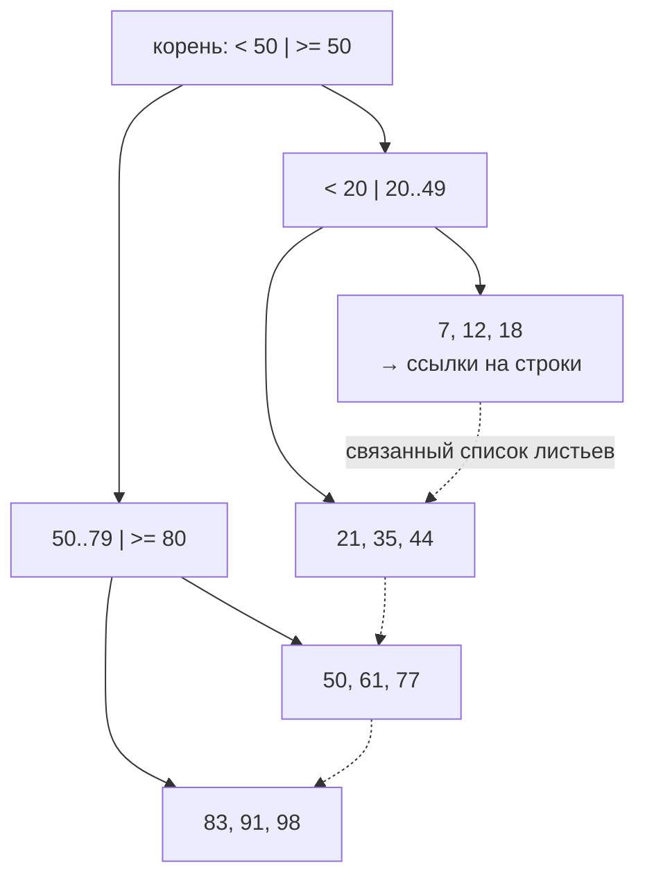
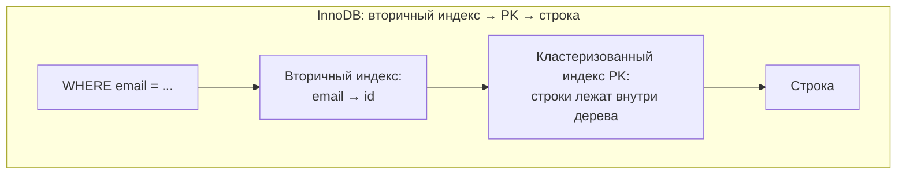
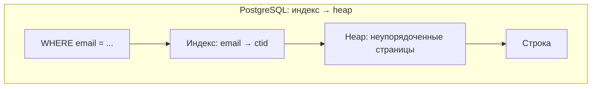
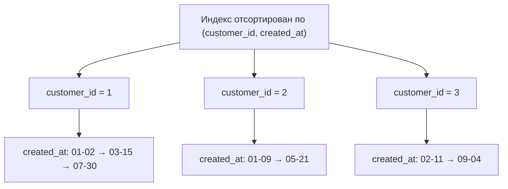

# Индексы

[← Оконные функции](window-functions.md) · [🏠 Домой](../README.md) · [Нормализация →](normalization.md)

---

## Что такое индекс и зачем он нужен?

**Коротко.** Дополнительная структура данных, которая позволяет найти нужные
строки, не читая всю таблицу. Ускоряет чтение ценой замедления записи и
дополнительного места на диске.

Без индекса СУБД выполняет последовательное сканирование (`seq scan`) — читает
все строки подряд. С индексом — спускается по дереву за логарифмическое время.

```sql
CREATE INDEX idx_orders_customer ON orders (customer_id);
```

Так устроен B+-дерево-индекс: во внутренних узлах — только границы диапазонов,
все ключи лежат в листьях, а листья связаны в список — отсюда дешёвые
диапазонные сканы и `ORDER BY`.



**Подвох.** «Чем больше индексов, тем лучше» — неверно. Каждый индекс нужно
обновлять при `INSERT`, `UPDATE` и `DELETE`, поэтому лишние индексы напрямую
замедляют запись и занимают место. На маленькой таблице планировщик вообще
проигнорирует индекс: прочитать сто строк подряд дешевле, чем ходить по дереву.

---

## Какие бывают типы индексов?

**Коротко.** Здесь важно не перепутать две независимые оси: **метод доступа**
(как устроена структура) и **физическая организация** таблицы. Терминология
сильно зависит от СУБД.

### PostgreSQL — по методу доступа

| Тип | Для чего |
|---|---|
| **B-tree** | По умолчанию. Равенство, диапазоны, сортировка, `LIKE 'abc%'` |
| **Hash** | Только точное равенство, быстрее B-tree на нём |
| **GIN** | Составные значения: `JSONB`, массивы, полнотекстовый поиск |
| **GiST** | Геометрия, диапазоны, поиск ближайших соседей |
| **SP-GiST** | Несбалансированные структуры: квадродеревья, префиксные деревья |
| **BRIN** | Очень большие таблицы с естественным порядком (логи по времени); крошечный размер |

Для Python-разработчика самый важный после B-tree — **GIN**: без него запросы
по `JSONB` будут сканировать таблицу целиком.

**Подвох.** Несмотря на теоретическое преимущество Hash на точном равенстве, на
практике его почти не используют: до PostgreSQL 10 такие индексы не
журналировались через WAL и были небезопасны при сбое и на репликах (после
восстановления их приходилось перестраивать вручную). Даже сейчас Hash не
поддерживает `ORDER BY` и диапазонные условия — поэтому B-tree, который умеет и
равенство, и диапазоны, и сортировку, почти всегда предпочтительнее.

### Кластеризованные индексы: осторожно с терминологией

В общем виде физическое хранение строк устроено одним из двух способов:
либо строки лежат упорядоченно по ключу — это и есть кластеризованный индекс,
данные хранятся прямо внутри самого индекса или отсортированы согласно ему, —
либо в произвольном порядке, как получилось при вставке (heap). Дальше это
общее деление раскрывается по-разному в конкретных СУБД.

Деление на **clustered / non-clustered** — это терминология **MS SQL Server** (и
по смыслу InnoDB), и переносить её на PostgreSQL нельзя.

- **MySQL / InnoDB** — таблица физически хранится как B+-дерево первичного
  ключа; это и есть кластеризованный индекс, он всегда один. Вторичные индексы
  хранят значение PK, поэтому поиск через них требует **двух** обращений: сначала
  по вторичному индексу к PK, потом по PK к строке.
- **PostgreSQL** — кластеризованных индексов **нет вообще**. Все таблицы —
  «кучи» (heap), физически неупорядоченные. Есть команда `CLUSTER table USING
  index`, но это разовая операция: новые и обновлённые строки снова лягут
  куда придётся, порядок автоматически не поддерживается.





**Подвох.** Уникальный индекс — это не «третий тип» в одном ряду с
кластеризованным и некластеризованным. Уникальность — **ограничение**,
ортогональное способу хранения: уникальный индекс сам может быть любого типа.

---

## Что такое составной индекс и почему важен порядок столбцов?

**Коротко.** Индекс по нескольким столбцам работает по правилу **левого
префикса**: он годится для условий по первым столбцам списка, но не по
последним в отрыве от первых.

```sql
CREATE INDEX idx ON orders (customer_id, created_at);
```

Этот индекс поможет запросам:

- `WHERE customer_id = 1`
- `WHERE customer_id = 1 AND created_at > '2026-01-01'`

и **не поможет** запросу `WHERE created_at > '2026-01-01'` — потому что без
первого столбца непонятно, с какого места дерева начинать.

Правило: столбцы с проверкой на равенство ставят раньше, чем столбцы с
диапазоном.



По датам порядок есть только **внутри** одного `customer_id`, поэтому запрос
без первого столбца не знает, с какой ветки начинать, и дерево бесполезно.

---

## Когда индекс не используется, хотя он есть?

Частый практический вопрос. Основные причины:

- **Функция или преобразование над столбцом.** `WHERE lower(email) = 'a@b.c'`
  обычный индекс по `email` не задействует. Лечится индексом по выражению:
  `CREATE INDEX ON users (lower(email))`.
- **Поиск с ведущим `%`.** `LIKE '%abc'` B-tree бесполезен — нужен полнотекстовый
  индекс или триграммы (`pg_trgm`).
- **Низкая селективность.** Если условию удовлетворяет заметная доля таблицы,
  последовательное чтение дешевле, и планировщик выбирает его сознательно.
- **Несовпадение типов**, из-за которого происходит неявное приведение.
- **Устаревшая статистика** — планировщик опирается на неё; лечится `ANALYZE`.

---

## Как понять, использовался ли индекс?

**Коротко.** `EXPLAIN` показывает план запроса, `EXPLAIN ANALYZE` — ещё и
реально выполняет его, показывая фактическое время и число строк.

```sql
EXPLAIN ANALYZE
SELECT * FROM orders WHERE customer_id = 1;
```

Что смотреть в выводе:

- `Seq Scan` — читается вся таблица; на большой таблице это сигнал проблемы.
- `Index Scan` — обращение к индексу, затем к самой строке за остальными полями.
- `Index Only Scan` — всё нужное нашлось прямо в индексе, к таблице обращаться не
  пришлось (это и есть «покрывающий» индекс — можно добавить лишние столбцы
  через `INCLUDE`).
- Расхождение между `rows=` в оценке и `actual rows=` — признак устаревшей
  статистики.

**Глубже.** Частичный индекс (`partial index`) индексирует не всю таблицу:
`CREATE INDEX ON orders (created_at) WHERE status = 'active'`. Он меньше, быстрее
обновляется и часто эффективнее полного, если запросы всегда содержат то же
условие.

---

[← Оконные функции](window-functions.md) · [🏠 Домой](../README.md) · [Нормализация →](normalization.md)
