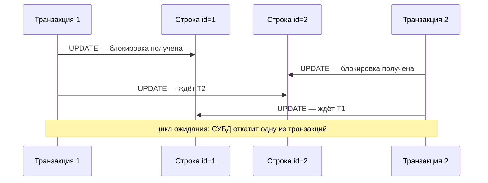
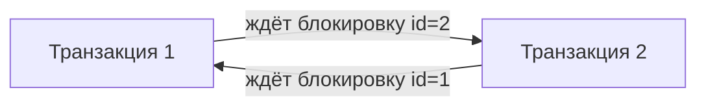

# Блокировки и дедлоки

[← ACID, изоляция и NULL](acid-and-null.md) · [🏠 Домой](../README.md) · [Внешние ссылки →](references.md)

---

## Как явно заблокировать строки: `SELECT ... FOR UPDATE`?

**Коротко.** `FOR UPDATE` — пессимистичная блокировка: транзакция читает
строки и сразу помечает их как «занятые», чтобы никто другой не смог их
изменить или так же заблокировать, пока эта транзакция не завершится
(`COMMIT`/`ROLLBACK`). Это отдельный механизм поверх MVCC: обычное чтение
(без `FOR UPDATE`) в PostgreSQL никогда не блокируется и не блокирует —
блокировки нужны именно тогда, когда план «прочитать, затем изменить на
основе прочитанного» должен быть атомарным относительно других транзакций.

```sql
BEGIN;
SELECT balance FROM accounts WHERE id = 1 FOR UPDATE;  -- заблокировала строку
-- в это время другая транзакция с FOR UPDATE или UPDATE на ту же строку ждёт
UPDATE accounts SET balance = balance - 100 WHERE id = 1;
COMMIT;                                                 -- блокировка снята
```

Без `FOR UPDATE` классический баг: две транзакции читают один и тот же
`balance`, обе вычисляют новое значение в приложении и обе пишут — одно
обновление молча теряется (lost update).

**Подвох.** `FOR UPDATE` блокирует строку монопольно (никто другой не
может ни изменить её, ни тоже взять `FOR UPDATE`); `FOR SHARE` — блокировка
на чтение, несколько транзакций могут одновременно держать `FOR SHARE` на
одной строке, но ни одна не сможет её изменить, пока все `FOR SHARE` не
снимутся. Для сценария «очередь задач», где несколько воркеров разбирают
строки параллельно и не должны блокировать друг друга на ожидании,
добавляют `SKIP LOCKED`: воркер пропускает уже занятые строки и берёт
следующую свободную, вместо того чтобы вставать в очередь на блокировку.
`NOWAIT` — противоположный приём: вместо ожидания сразу вернуть ошибку,
если строка уже заблокирована.

**Глубже.** Блокировка строки в PostgreSQL живёт строго в рамках
транзакции — вне явного `BEGIN...COMMIT` каждая команда сама себе
транзакция, и `FOR UPDATE` снимется сразу после неё, что обычно бессмысленно.

---

## Что такое дедлок и как его избежать?

**Коротко.** Дедлок — взаимная блокировка: транзакция A ждёт ресурс,
занятый транзакцией B, а B в это время ждёт ресурс, занятый A. Ни одна не
может продолжить, обе стоят вечно, если ничего не вмешается.



Тот же цикл как граф ожидания — именно его ищет детектор дедлоков:



```sql
-- Транзакция 1                    -- Транзакция 2
BEGIN;                             BEGIN;
UPDATE accounts SET ... WHERE id=1; UPDATE accounts SET ... WHERE id=2;
UPDATE accounts SET ... WHERE id=2; -- ждёт id=2, занята транзакцией 2
                                    UPDATE accounts SET ... WHERE id=1; -- ждёт id=1, занята транзакцией 1
                                    -- дедлок
```

СУБД сама обнаруживает цикл ожидания (PostgreSQL — по таймеру
`deadlock_timeout`, по умолчанию 1 секунда) и принудительно откатывает
одну из транзакций с ошибкой `deadlock detected`, чтобы освободить
вторую. Приложение обязано быть готово поймать эту ошибку и повторить
транзакцию — так же, как и ошибку сериализации на уровне `SERIALIZABLE`
(см. [ACID, изоляция и NULL](acid-and-null.md)).

**Подвох.** Дедлок — это не признак «сломанной» СУБД, а ожидаемый исход
при неудачном порядке блокировок. Главная практическая защита —
**всегда блокировать ресурсы в одном и том же порядке** во всех
транзакциях (например, по возрастанию `id`): тогда цикл ожидания в
принципе не может образоваться.

**Глубже.** Диагностировать реальный дедлок или просто долгое ожидание
блокировки в PostgreSQL можно через системное представление `pg_locks`
(что заблокировано и кем) в связке с `pg_stat_activity` (что за
транзакция и какой у неё запрос). Livelock — смежная, но более редкая
проблема: транзакции не стоят намертво, а бесконечно уступают друг другу
и откатываются, не давая друг другу продвинуться, — формально прогресс
есть, а полезной работы нет.

---

[← ACID, изоляция и NULL](acid-and-null.md) · [🏠 Домой](../README.md) · [Внешние ссылки →](references.md)
