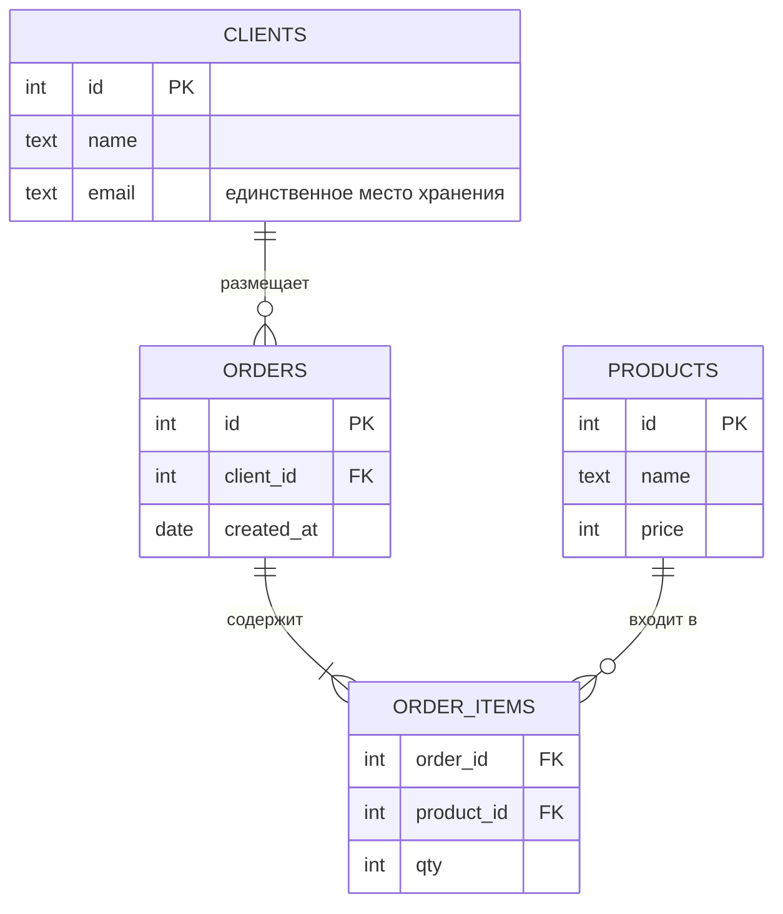

# Нормализация и денормализация

[← Индексы](indexes.md) · [🏠 Домой](../README.md) · [ACID, изоляция и NULL →](acid-and-null.md)

---

## Что такое нормализация и зачем она нужна?

**Коротко.** Приведение схемы к виду, где каждый факт хранится ровно в одном
месте. Цель — убрать избыточность и вытекающие из неё аномалии обновления.

Проблема, которую решает нормализация, видна на одной таблице:

```
orders_flat
┌────┬─────────┬──────────────────┬──────────┐
│ id │ client  │ client_email     │ product  │
├────┼─────────┼──────────────────┼──────────┤
│  1 │ Анна    │ anna@mail.ru     │ Клавиатура│
│  2 │ Анна    │ anna@mail.ru     │ Мышь     │
└────┴─────────┴──────────────────┴──────────┘
```

Почта Анны продублирована. Отсюда три классические аномалии:

- **аномалия обновления** — сменив почту, надо обновить все строки; пропустили
  одну — данные противоречивы;
- **аномалия вставки** — нельзя завести клиента, пока у него нет заказа;
- **аномалия удаления** — удалив последний заказ, теряем и самого клиента.

После разнесения фактов по таблицам почта клиента хранится ровно в одном месте:



---

## Что требуют нормальные формы?

**1NF — первая нормальная форма.** Все значения атомарны (неделимы), нет
повторяющихся групп, у каждой строки есть уникальный идентификатор.

Нарушение — список в одной ячейке:

```
❌ products: "Клавиатура, Мышь"      ✅ отдельная строка на каждый товар
❌ phone1, phone2, phone3            ✅ отдельная таблица телефонов
```

**2NF.** Выполнена 1NF, и каждый неключевой атрибут зависит от **всего**
первичного ключа, а не от его части. Условие содержательно только при
**составном** ключе: если ключ из одного столбца, таблица в 1NF автоматически в
2NF.

```
❌ order_items(order_id, product_id, qty, product_name)
   product_name зависит только от product_id — то есть от части ключа
✅ product_name переезжает в таблицу products
```

**3NF.** Выполнена 2NF, и неключевые атрибуты не зависят друг от друга
(нет транзитивной зависимости).

```
❌ employees(id, name, dept_id, dept_name)
   dept_name зависит от dept_id, а тот — от id: транзитивно
✅ dept_name переезжает в таблицу departments
```

**BCNF (форма Бойса — Кодда)** — усиление 3NF: **любой** детерминант должен быть
потенциальным ключом. Отличие проявляется в редком случае — когда неключевой
атрибут определяет часть составного ключа. На собеседовании обычно достаточно
знать, что BCNF строже 3NF и в чём именно.

**Подвох.** Три термина, которыми оперируют определения, стоит уметь назвать:
**функциональная зависимость** (по значению A однозначно определяется B),
**частичная** (B зависит от части составного ключа — нарушает 2NF) и
**транзитивная** (A → B → C — нарушает 3NF).

**Глубже.** Есть ещё 4NF (многозначные зависимости) и 5NF, но на практике схему
почти всегда доводят до 3NF/BCNF и останавливаются.

---

## Что такое денормализация и когда она оправдана?

**Коротко.** Осознанное внесение избыточности ради скорости чтения: продублировать
данные, чтобы не делать дорогой `JOIN` или агрегат на каждый запрос.

Типичные приёмы: хранить `orders_count` прямо в карточке клиента, дублировать
название товара в позиции заказа (чтобы сохранить его на момент покупки),
держать материализованное представление.

**Подвох.** Денормализация — это не «нормализация не нужна», а осознанный размен:
вы меняете простоту записи на скорость чтения и **берёте на себя** обязанность
поддерживать дубликаты в согласованном состоянии. Правильный порядок —
сначала нормализовать, потом денормализовать точечно там, где профилирование
показало проблему.

---

[← Индексы](indexes.md) · [🏠 Домой](../README.md) · [ACID, изоляция и NULL →](acid-and-null.md)
