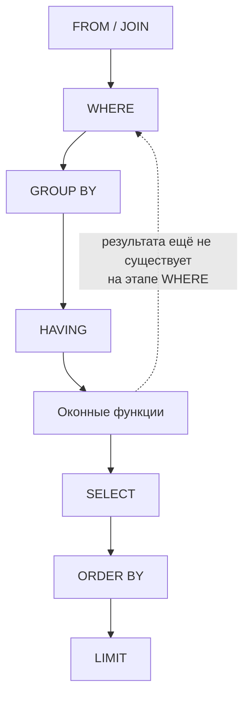

# Оконные функции

[← JOIN](joins.md) · [🏠 Домой](../README.md) · [Индексы →](indexes.md)

---

## Чем оконная функция отличается от `GROUP BY`?

**Коротко.** `GROUP BY` схлопывает несколько строк в одну на группу.
Оконная функция считает агрегат или ранг **для каждой строки отдельно**,
не уменьшая их число — «окно» строк, по которому считается значение, задаётся
через `OVER (...)`, а сама строка остаётся на месте.

```sql
-- GROUP BY: одна строка на отдел, детали заказов теряются
SELECT dept, AVG(salary) FROM employees GROUP BY dept;

-- Оконная функция: строк столько же, сколько сотрудников,
-- но у каждой видна средняя зарплата её отдела
SELECT
    name, dept, salary,
    AVG(salary) OVER (PARTITION BY dept) AS dept_avg
FROM employees;
```

`PARTITION BY` в оконной функции — это аналог `GROUP BY` по смыслу
разбиения на группы, но группы не схлопываются: `PARTITION BY dept`
означает «считать окно отдельно в пределах каждого отдела».

Порядок вычисления в запросе — то, из-за чего оконную функцию нельзя
использовать в `WHERE`:



**Подвох.** Оконные функции вычисляются **после** `WHERE`, `GROUP BY` и
`HAVING`, но **до** `ORDER BY` и `LIMIT` — из-за этого их результат нельзя
использовать в `WHERE` того же уровня запроса (`WHERE dept_avg > 50000`
даст ошибку `column "dept_avg" does not exist`). Чтобы отфильтровать по
значению оконной функции, её оборачивают в подзапрос или `WITH`-CTE и
фильтруют уже снаружи.

**Глубже.** Границы окна можно сузить дальше самого раздела через
`ROWS BETWEEN` / `RANGE BETWEEN` — например, скользящее среднее по трём
предыдущим строкам:

```sql
SELECT
    day, revenue,
    AVG(revenue) OVER (ORDER BY day ROWS BETWEEN 2 PRECEDING AND CURRENT ROW)
        AS moving_avg_3d
FROM daily_sales;
```

---

## Чем отличаются `ROW_NUMBER`, `RANK` и `DENSE_RANK`?

**Коротко.** Все три нумеруют строки внутри `PARTITION BY` по порядку из
`ORDER BY`, но по-разному обходятся с одинаковыми значениями (ties):
`ROW_NUMBER` всегда даёт уникальные номера подряд, `RANK` оставляет пропуски
после связки, `DENSE_RANK` — не оставляет.

```sql
SELECT
    name, score,
    ROW_NUMBER() OVER (ORDER BY score DESC) AS rn,
    RANK()       OVER (ORDER BY score DESC) AS rnk,
    DENSE_RANK() OVER (ORDER BY score DESC) AS drnk
FROM contest;

-- name   | score | rn | rnk | drnk
-- Anna   | 100   | 1  | 1   | 1
-- Boris  | 90    | 2  | 2   | 2
-- Carl   | 90    | 3  | 2   | 2   -- та же связка
-- Dana   | 80    | 4  | 4   | 3   -- RANK пропускает 3, DENSE_RANK — нет
```

**Подвох.** Классическая задача «второй по зарплате в каждом отделе» —
готовый повод спутать `RANK` с `DENSE_RANK`: если два сотрудника делят
первое место, `RANK` пометит следующего как третьего (пропуск), а
`DENSE_RANK` — как второго. Условие задачи обычно решает, какая семантика
нужна; если не оговорено явно, стоит уточнить это на собеседовании, а не
угадывать.

**Глубже.** `ROW_NUMBER() OVER (PARTITION BY key ORDER BY ts DESC) = 1` —
стандартный приём достать «последнюю запись на группу» без `GROUP BY` и
без `DISTINCT ON` (последнее — расширение только PostgreSQL).

---

## Как получить значение соседней строки: `LAG`/`LEAD`?

**Коротко.** `LAG(col, n)` берёт значение из строки на `n` позиций назад,
`LEAD(col, n)` — вперёд, в пределах того же `PARTITION BY`/`ORDER BY`. Без
них ту же задачу решали бы self join по соседним строкам.

```sql
SELECT
    day, revenue,
    revenue - LAG(revenue) OVER (ORDER BY day) AS diff_from_prev_day
FROM daily_sales;
```

**Подвох.** У первой строки в разделе нет «предыдущей» — `LAG` вернёт
`NULL`, если не передать третий аргумент со значением по умолчанию:
`LAG(revenue, 1, 0) OVER (...)`. Забытый `NULL` дальше по цепочке
арифметики (`NULL - 5`) молча даёт `NULL`, а не ошибку.

---

[← JOIN](joins.md) · [🏠 Домой](../README.md) · [Индексы →](indexes.md)
